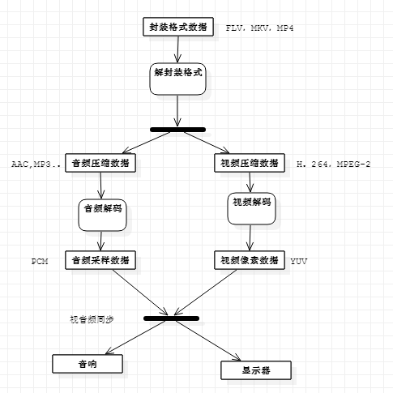

# 1.视频工具简介
## 1.1视频解析

视频解析的过程如下图：

## 1.2常用的播放器

* 跨平台系列(非DirectShow框架)
	* VLC,Mplayer,ffplay...
* Windows系列(DirectShow框架)
	* 完美解码，终极解码，暴风影音...

## 1.3 相关工具使用

* 综合信息查看工具
	* MediaInfo
* 二进制信息查看
	* UltraEdit
* 单项详细分析
	* 封装格式：Elecard Format Aanlyzer
	* 视频编码数据：Elecard Stream Eye
	* 视频像素数据：YUV Player
	* 音频采样数据：Adobe Audition

# 2.封装格式
## 2.1 封装格式作用

视频码流和音频码流按照一定的格式存储在一个文件中。

