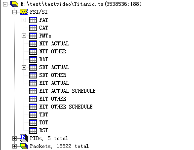

# 1.视频工具简介
## 1.1视频解析

视频解析的过程如下图：

## 1.2常用的播放器

* 跨平台系列(非DirectShow框架)
	* VLC,Mplayer,ffplay...
* Windows系列(DirectShow框架)
	* 完美解码，终极解码，暴风影音...

## 1.3 相关工具使用

* 综合信息查看工具
	* MediaInfo
* 二进制信息查看
	* UltraEdit
* 单项详细分析
	* 封装格式：Elecard Format Aanlyzer
	* 视频编码数据：Elecard Stream Eye
	* 视频像素数据：YUV Player
	* 音频采样数据：Adobe Audition

# 2.封装格式
## 2.1 封装格式作用

视频码流和音频码流按照一定的格式存储在一个文件中。

## 2.2 封装格式分析工具

* Elecard Format Analyzer

|名称|推出机构|目前使用用途|
|--|--|--|
|AVI|Microsoft Inc.|BT下载影视|
|MP4|MPEG|互联网视频网站|
|TS|MPEG|IPTV,数字电视|
|FLV|Adobe Inc.|互联网视频网站|
|MKV|CoreCodec Inc.|互联网视频网站|
|RMVB|Real Networks Inc.|BT下载影视|

### MPEG2-TS格式简介

* **不包含文件头**。数据大小固定(188Byte)的TS Packet构成。

### FLV格式简介

**包含头文件**：数据大小由大小不固定的Tag构成。

# 2.视频编码数据格式

### 视频编码的作用

将视频像素数据(RGB,YUV等)，压缩成视频码流，从而降低视频的数据量

视频编码分析工具：Elecard stream eye

|名称|退出机构|推出时间|目前使用领域|
|--|--|--|--|
|HEVC(H.265)|MPEG/ITU-T|2013|研发中|
|H.264|MPEG/ITU-T|2003|各个领域|
|MPEG2|MPEG|2001|不温不火|
|VP9|Google|2013|研发汇中|
|VP8|Google|2008|不普及|
|VC-1|Microsoft Inc.|2006|微软平台|

### H.264格式简介

* 数据大小不固定的NALU构成
* 最常见的情况下，1个NALU存储了1帧画面的压缩编码后的数据。

H.264压缩过程很复杂。I帧，红色。 P帧：蓝色 B帧，绿色 

#3.视频编码数据

* 音频编码作用
将音频采样数据(PCM等）压缩成音频码流，从而降低音频的数据量。
* 音频编码数据工具
暂时不涉及

|名称|退出机构|推出时间|目前使用领域|
|--|--|--|--|
|AAC|MPEG|1997|各个领域|
|AC-3|Dolby Inc.|1992|电影|
|MP3|MPEG|1993|各个领域(旧)|
|WMA|Microsoft Inc.|1999|微软平台|
