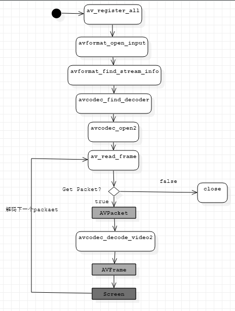
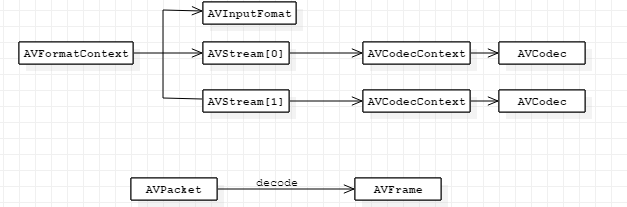
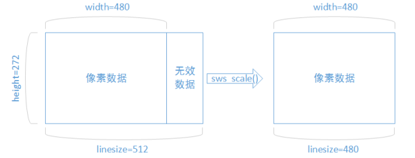

# 视频解码
# 1.FFmpeg库简介

FFmpeg一共包含8个库：

* avcodec:编码库(最重要的库)
* avformat:封装格式处理
* avfilter:滤镜特效处理
* avdevice:各种设备的输入输出
* avutil:工具类
* postproc:后加工
* swsample:音频采样数据格式转化
* swscale:视频像素数据格式转换

# 2.FFmpeg解码函数简介

* `av_register_all()`:注册所有组件
* `avformat_open_input()`:打开输入视频文件
* `avformat_find_stream_info()`:获取视频文件信息。
* `avcodec_find_decoder()`:查找解码器
* `avcodec_open2()`:打开解码器
* `av_read_frame()`:从输入文件读取一帧压缩数据
* `avcodec_decode_video2()`:解码一帧压缩数据
* `avcodec_close()`:关闭解码器
* `avformat_close_input()`:关闭输入视频文件

# 2.FFmpeg解码的数据结构
## 2.1 FFmpeg解码数据结构
FFmpeg解码的数据结构关系如下图：

## 2.2 具体结构
### 2.2.1 AVFormatContext
封装格式上下文结构体，也是统领全局的机结构体，保存了**视频文件封装格式相关信息**。

* iformat:输入视频的AVInputFormat
* nb_streams:输入视频的AVStream个数
* streams:输入视频的`AVStream[]`数组
* duration:输入视频的时长(微妙单位)
* bit_rate:输入视频的码率

### 2.2.2AVInputFormat
每种封装格式(例如FLV,MKV,MP4，AVI)对应一个该结构体。

* name:封装格式名称
* long_name:封装格式的长名称
* extensions:封装格式的扩展名
* id:封装格式ID
* 一些封装格式处理的接口函数

### 2.2.3AVStream
视频文件中每个视频(音频)对应一个该结构体。

* id：序号
* codec:该流对应的AVCodecContext
* time_base:该流的时基
* r_frame_rate:该流的帧率

### 2.2.3AVCodecContext
编码器上下文结构体，保存了视频(音频)编解码相关信息。

*　codec:编解码器的codec
*　width,height:图像的宽高(只针对视频)
*　pix_fmt:像素格式(只针对视频)
*　sample_rate:采样率(只针对音频)
*　channels:声道数(只针对音频)
*　sample_fmt:采样格式(只针对音频)

### 2.2.4 AVCodec
每种视频(音频)编解码器(例如H.264解码器)对应一个该结构体

* name:编解码器名称
* long_name:编解码器长名称
* type:编解码类型
* id:编解码器ID
* 一些编解码的接口函数

### 2.2.5 AVPacket
存储一帧压缩编码数据

* pts:显示时间戳
* dts:解码时间戳
* data:压缩编码数据
* size：压缩编码数据大小
* stream_index:所属的AVStream

### 2.2.6 AVFrame
存储一帧解码后像素(采集)数据

* data:解码后的图像像素(音频采样)数据
* linesize:
	* 对视频来说是图像中**一行像素的大小**；
	* 对音频来说是**整个音频帧的大小**。
* widht,height:图像的宽高(只针对视频)
* key_frame:是否为关键帧(只针对视频)
* pict_type:帧类型(只针对视频).例如I,P,B。

### 解码后的数据为什么要经过sws_scale函数处理？

解码后的数据存放子啊AVFrame的`data[0]`,`data[1]`中。但是这些不是连续存储的，每行有效像素之后存储一些无效像素。

以亮度Y数据为例，`data[0]`中一共包含了`linesize[0]*height`个数据。但是出于优化等方面考虑，`linesize[0]`实际上并不等于宽width，而是一个比宽大一些的值。

使用`sws_scale()`进行转换，转换后去除了无效数据，width和`linesize[0]`取值相等.

