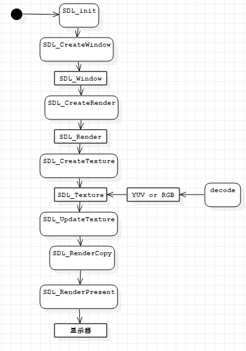
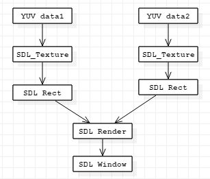

# SDL视频显示函数

# 1.SDL视频显示流程图

SDL视频显示函数简介：

* `SDL_Init()`：初始化SDL系统
* `SDL_CreateWindow()`：创建窗口SDL_Window
* `SDL_CreateRenderer()`:创建渲染器SDL_Renderer
* `SDL_CreateTexture()`：创建纹理SDL_Texture
* `SDL_UpdateTexture()`:设置纹理的数据
* `SDL_RenderCopy()`:将纹理数据拷贝给渲染器
* `SDL_RenderPresent()`:显示

