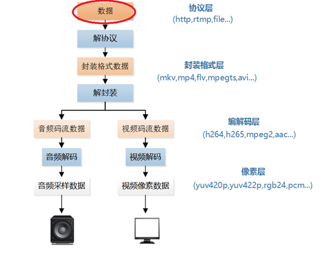
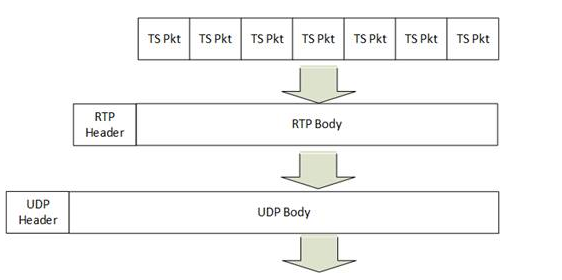

本文介绍网络协议数据的处理程序。网络协议数据在视频播放器中的位置如下所示


本文中的程序是一个UDP/RTP协议流媒体数据解析器。该程序可以分析UDP协议中的RTP 包头中的内容，以及RTP负载中MPEG-TS封装格式的信息。通过修改该程序可以实现不同的`UDP/RTP`协议数据处理功能。

# 1.原理
`MPEG-TS`封装格式数据打包为`RTP/UDP`协议然后发送出去的流程如下图所示。图中首先每7个`MPEG-TS Packet`打包为一个RTP，然后每个RTP再打包为一个UDP。其中打包RTP的方法就是在MPEG-TS数据前面加上`RTP Header`，而打包RTP的方法就是在RTP数据前面加上`UDP Header`。



程序是一个收取流媒体的程序，因此本文程序的流程和上述发送MPEG-TS的流程正好是相反的。该程序可以通过Socket编程收取UDP包，解析其中的RTP包的信息，然后再解析RTP包中MPEG-TS Packet的信息。

# 2.代码
整个程序位于`simplest_udp_parser()`函数中，如下所示。

```c
/*
	FFmepg stream command
#ffmpeg -re -i sintel.ts -f mpegts udp:127.0.0.1:8880
#ffmpeg -re -i sintel.ts -f rtp_mpegts udp://127.0.0.1:8880
*/
#include <stdio.h>
#include <winsock2.h>
 
#pragma comment(lib, "ws2_32.lib") 
 
#pragma pack(1)

typedef struct RTP_FIXED_HEADER{
	/*byte 0*/
	unsigned char csrc_len:4;  //expect 0
	unsigned char extension:1; //expect 1
	unsigned char padding:1;   //expect 0
	unsigned char version:2;   //expect 2
	/*byte 1*/
	unsigned char payload:7;
	unsigned char marker:1;    //expect 1
	/*byte 2,3*/
	unsigned short seq_no;
	/*bytes 4-7*/
	unsigned long timestamp;
	/*bytes 8-11*/
	unsigned long ssrc;       //stream number is used here	
}RTP_FIXED_HEADER;

typedef struct MPEGTS_FIXED_HEADER{
	unsigned sync_byte:8;
	unsigned transport_error_indicator:1;
	unsigned payload_unit_start_indicator:1;
	unsigned transport_priority:1;
	unsigned PID:13;
	unsigned scrambling_control:2;
	unsigned adapation_filed_exist:2;
	unsigned continuity_counter:4;
}MPEGTS_FIXED_HEADER;
int simple_udp_parser(int port){
	FILE*myout=stdout;
	FILE*fp1=fopen("output_dump.ts","wb+");
	WSADATA wsaData;
	WORD sockVersion=MAKEWORD(2,2);
	if(WSAStartup(sockVersion,&wsaData)!=0){
		return 0;
	}
	SOCKET serSocket=socket(AF_INET,SOCK_DGRAM,IPPROTO_UDP);
	if(serSocket == INVALID_SOCKET){
		printf("socket error!");
		return 0;
	}
	sockaddr_in serAddr;
	serAddr.sin_family=AF_INET;
	serAddr.sin_port=htons(port);
	serAddr.sin_addr.S_un.S_addr=INADDR_ANY;
	if(bind(serSocket,(socketaddr*)&serAddr,sizeof(serAddr))==SOCKET_ERROR){
		printf("bind error!");
		closesocket(serSocket);
		return 0;
	}
	socketaddr_in remoteAddr;
	int nAddrLen=sizeof(remoteAddr);
	//how to parse
	int parse_rtp=1;
	int parse_mpegts=1;
	printf("Listening on port %d\n",port);
	char recvData[10000];
	while(1){
		//1.接收到UDP Body
		int pktsize=recvfrom(serSocekt,recvData,10000,0,(sockaddr*)&remoteAddr);
		if(pktsize>0){
			//TODO parse RTP 解析RTP过程
			printf("packet size%d\n",pktsize);
			if(parse_rtp!=0){
				char payload_str[10]={0};
				RTP_FIXED_HEADER rpt_header;
				int rtp_header_size=sizeof(RTP_FIXED_HEADER);
				//RTP Header
				memcpy((void*)&rtp_header,recvData,rpt_header_size);
				//RRC3551
				char payload=rtp_header.payload;
				switch(payload){
					case 0:
					case 1:
					case 2:
					...
					case 18:sprintf(payload_str,"Audio");break;
					case 31:sprint(payload_str,"H.2G1");break;	
					case 32:sprint(payload_str,"MPV");break;		
					case 33:sprintf(payload_str,"MP2T");break;
					case 34:sprintf(payload_str,"H.2G3");break;
					case 96:sprintf(payload_str,"H.264");break;
					default:sprintf(payload_str,"other");break;
				}
				unsigned int timestamp=ntohl(rtp_header.timestamp);
				unsigned int seq_no=rtp_header.seq_no);
				fprintf(myout,"[RTP Pkt] %5d| %5s| %10u| %5d| %5d|\n",cnt,payload_str,timestamp,seq_no,pktsize);
				//TODO parse MPEGTS 根据payload_str进行编码类型
				if(parse_mpegts!=0&&payload==33){
					MPEGTS_FIXED_HEADER mpegts_header;
					//多个TS包，每个包常为188字节,并且开头字节为0x47
				 	for(int i=0;i<rtp_data_size;i=i+188){
						if(rtp_data[i]!=0x47){
							break;		
						}
						//MPEGTS Header
						//memcpy((void *)&mpegts_header,rtp_data+i,sizeof(MPEGTS_FIXED_HEADER));
						fprintf(myout,"MPEGTS pkt\n");
					}
				}
			}else{
				fprintf(myout,"[UDP Pkt %5d | %5d| \d]",cnt,pktsize);
				fwrite(recvData,pktsize,1,fp1);
			}
			cnt++;
		}
	}
	closesocket(sersocket);
	WSACleanup();
	fclose(fp1);
	return 0;
}
```

上文中函数调用的方法：`simple_udp_parser(8880)`
