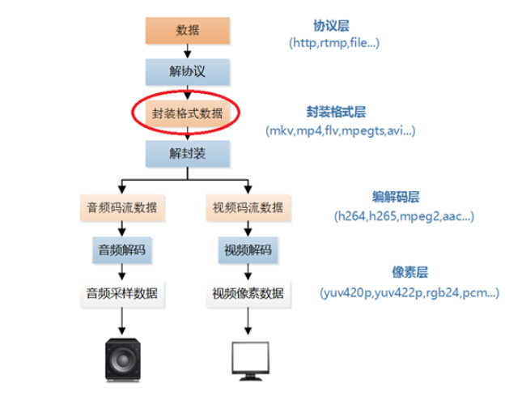
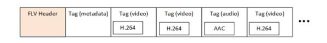

本文中的程序是一个FLV封装格式解析程序。该程序可以从FLV中分析得到它的基本单元Tag，并且可以简单解析Tag首部的字段。通过修改该程序可以实现不同的FLV格式数据处理功能。



# 1.原理

FLV封装格式是由一个FLV Header文件头和一个一个的Tag组成的。Tag中包含了音频数据以及视频数据。FLV的结构如下图所示。



[视音频编解码学习工程：FLV封装格式分析器](https://blog.csdn.net/leixiaohua1020/article/details/17934487)

本文的程序实现了FLV中的FLV Header和Tag的解析，并可以分离出其中的音频流。

# 2.代码

```c
#include <stdio.h>
#include <stdlib.h>
#include <string.h>

#pargma pack(1)

#define TAG_TYPE_SCRIPT 18
#define TAG_TYPE_AUDIO  8
#define TAG_TYPE_VIDEO  9
typdef unsigned char byte;
typdef unsigned int  uint;

typdef struct{
	byte Signature[3];
	byte Version;
	byte Flags;
	uint DataOffset;
}FLV_HEADER;

typdef struct {
	byte TagType;
	byte DataSize[3];
	byte Timestamp[3];
	uint Reserved;
}TAG_HEADER;

//reverse_bytes:turn a BigEndian byte array into a littleEndian Integer

uint reserve_bytes(byte*p,char c){
	int r=0;
	int i;
	for(i=0;i<c;i++){
		r|=(*(p+i)<<((c-1)*8)-8*i);	
	}
	return r;
}
/**
*location of input FLV file
**/
int simple_flv_parser(char *url){
	//whether output audio/video stream
	int output_a=1;
	int output_v=1;
	FILE *ifh=NULL,*vfh=NULL,*afh=NULL;
	//FILE *myout=fopen("output_log.txt","wb+");
	FILE*myout=stdout;
	FLV_HEADER flv;
	TAG_HEADER tagheader;
	uint previoustagsize,previoustagsize_z=0;
	uint ts=0,ts_new=0;
	ifh=fopen(url,"rb+");
	if(ifh=NULL){
		printf("failed to open files!");
		return -1;
	}

	//FLV file header
	fread((char*)&flv,1,sizeof(FLV_HEADER),ifh);
		
	fprintf(myout,"============== FLV Header ==============\n");
	fprintf(myout,"Signature:  0x %c %c %c\n",flv.Signature[0],flv.Signature[1],flv.Signature[2]);
	fprintf(myout,"Version:    0x %X\n",flv.Version);
	fprintf(myout,"Flags  :    0x %X\n",flv.Flags);
	fprintf(myout,"HeaderSize: 0x %X\n",reverse_bytes((byte *)&flv.DataOffset, sizeof(flv.DataOffset)));
	fprintf(myout,"========================================\n");

	//move the file pointer to the end of the header
	fseek(ifh,reverse_bytes((byte*)&flv.DataOffset,sizeof(flv.DataOffset)),SEEK_SET);
	//Process each tag
	do{
		previoustagsize=_getw(ifh);
		fread((void*)&tageheader,sizeof(TAG_HEADER),1,ifh);
		//int temp_datasize1=reverse_bytes((byte *)&tagheader.DataSize, sizeof(tagheader.DataSize));
		int tagheader_datasize=tagheader.DataSize[0]*65536+tagheader.DataSize[1]*256+tagheader.DataSize[2];
		int tagheader_timestamp=tagheader.Timestamp[0]*65536+tagheader.Timestamp[1]*256+tagheader.Timestamp[2];
		
		char tagtype_str[10];
		switch(tagheader.TagType){
			case TAG_TYPE_AUDIO:sprintf(tagtype_str,"AUDIO");break;
			case TAG_TYPE_VIDEO:sprintf(tagtype_str,"VIDEO");break;
			case TAG_TYPE_SCRIPT:sprintf(tagtype_str,"SCRIPT");break;
			default:sprintf(tagtype_str,"UNKNOW");break;
		}
		fprintf(myout,"[%6s] %6d %6d |",tagtype_str,tagheader_datasize,tagheader_timestamp);
		//if we are not past the end of file,process the tag
		if(feof(ifh) break;
		//process tag by type
		switch(tagheader.TagType){
		case TAG_TYPE_AUDIO:
			char audiotag_str[100]={0};
			strcat(audiotag_str,"| ");
			char tagdata_first_byte;
			tagdata_first_byte=fgetc(ifh);
			int x=tagdata_first_byte&0xF0;
			//第8,7,6,5位处理
			x=x>>4;
			switch(x){
			case 0:strcat(audiotag_str,"Lineer PCM,platform endian");break;
			case 1:strcat(audiotag_str,"ADPCM");break;
			case 2:strcat(audiotag_str,"MP3");break;
			case 3:strcat(audiotag_str,"Lineer PCM,litte endian");break;
			case 4:strcat(audiotag_str,"Nellymoser 16-kHz mono");break;
			case 5:strcat(audiotag_str,"Nellymoser 8-kHz mono");break;
			case 6:strcat(audiotag_str,"Nellymoser");break;
			case 7:strcat(audiotag_str,"G.711 A-law logarithmic PCM");break;
			case 8:strcat(audiotag_str,"G.711 mu-law logarithmic PCM");break;
			case 9:strcat(audiotag_str,"reserved");break;
			case 10:strcat(audiotag_str,"AAC");break;
			case 11:strcat(audiotag_str,"Speex");break;
			case 14:strcat(audiotag_str,"MP3 8-Khz");break;
			case 15:strcat(audiotag_str,"Device-specific sound");break;
			default:strcat(audiotag_str,"UNKNOWN");break;
			}
			strcat(audiotag_str,"| ");
			x=tagdata_first_bytes&0x0c;  //0x00001100
			//第3,4位有效
			x=x>>2;
			switch(x){
			case 0:strcat(audiotag_str,"5.5-kHz");break;
			case 1:strcat(audiotag_str,"1-kHz");break;
			case 2:strcat(audiotag_str,"22-kHz");break;
			case 3:strcat(audiotag_str,"44-kHz");break;
			default:strcat(audiotag_str,"UNKNOWN");break;
			}
			strcat(audiotag_str,"| ");
			x=tagdata_first_byte&0x02;
			//第2位处理
			x=x>>1;
			switch (x)
			{
			case 0:strcat(audiotag_str,"8Bit");break;
			case 1:strcat(audiotag_str,"16Bit");break;
			default:strcat(audiotag_str,"UNKNOWN");break;
			}
			strcat(audiotag_str,"| ");
			//第1位处理
			x=tagdata_first_byte&0x01;
			switch (x)
			{
			case 0:strcat(audiotag_str,"Mono");break;
			case 1:strcat(audiotag_str,"Stereo");break;
			default:strcat(audiotag_str,"UNKNOWN");break;
			}
			fprintf(myout,"%s",audiotag_str);
			//if the output file hasn't been opened, open it.
			if(output_a!=0&&afh == NULL){
				afh = fopen("output.mp3", "wb");
			}
		
			//TagData - First Byte Data
			int data_size=reverse_bytes((byte *)&tagheader.DataSize, sizeof(tagheader.DataSize))-1;
			if(output_a!=0){
				//TagData+1
				for (int i=0; i<data_size; i++)
					fputc(fgetc(ifh),afh);

			}else{
				for (int i=0; i<data_size; i++)
					fgetc(ifh);
			}
			break;
		case TAG_TYPE_VIDEO:
			char videotag_str[100]={0};
			strcat(videotag_str,"| ");
			char tagdata_first_byte;
			tagdata_first_byte=fgetc(ifh);
			int x=tagdata_first_byte&0xF0;
			x=x>>4;
			switch (x)
			{
			case 1:strcat(videotag_str,"key frame  ");break;
			case 2:strcat(videotag_str,"inter frame");break;
			case 3:strcat(videotag_str,"disposable inter frame");break;
			case 4:strcat(videotag_str,"generated keyframe");break;
			case 5:strcat(videotag_str,"video info/command frame");break;
			default:strcat(videotag_str,"UNKNOWN");break;
			}
			strcat(videotag_str,"| ");
			x=tagdata_first_byte&0x0F;
			switch (x)
			{
			case 1:strcat(videotag_str,"JPEG (currently unused)");break;
			case 2:strcat(videotag_str,"Sorenson H.263");break;
			case 3:strcat(videotag_str,"Screen video");break;
			case 4:strcat(videotag_str,"On2 VP6");break;
			case 5:strcat(videotag_str,"On2 VP6 with alpha channel");break;
			case 6:strcat(videotag_str,"Screen video version 2");break;
			case 7:strcat(videotag_str,"AVC");break;
			default:strcat(videotag_str,"UNKNOWN");break;
			}
			fprintf(myout,"%s",videotag_str);

			fseek(ifh, -1, SEEK_CUR);
			//if the output file hasn't been opened, open it.
			if (vfh == NULL&&output_v!=0) {
				//write the flv header (reuse the original file's hdr) and first previoustagsize
					vfh = fopen("output.flv", "wb");
					fwrite((char *)&flv,1, sizeof(flv),vfh);
					fwrite((char *)&previoustagsize_z,1,sizeof(previoustagsize_z),vfh);
			}
#if 0
			//Change Timestamp
			//Get Timestamp
			ts = reverse_bytes((byte *)&tagheader.Timestamp, sizeof(tagheader.Timestamp));
			ts=ts*2;
			//Writeback Timestamp
			ts_new = reverse_bytes((byte *)&ts, sizeof(ts));
			memcpy(&tagheader.Timestamp, ((char *)&ts_new) + 1, sizeof(tagheader.Timestamp));
#endif


			//TagData + Previous Tag Size
			int data_size=reverse_bytes((byte *)&tagheader.DataSize, sizeof(tagheader.DataSize))+4;
			if(output_v!=0){
				//TagHeader
				fwrite((char *)&tagheader,1, sizeof(tagheader),vfh);
				//TagData
				for (int i=0; i<data_size; i++)
					fputc(fgetc(ifh),vfh);
			}else{
				for (int i=0; i<data_size; i++)
					fgetc(ifh);
			}
			//rewind 4 bytes, because we need to read the previoustagsize again for the loop's sake
			fseek(ifh, -4, SEEK_CUR);

			break;
			}
		default:
			//skip the data of this tag
			fseek(ifh, reverse_bytes((byte *)&tagheader.DataSize, sizeof(tagheader.DataSize)), SEEK_CUR);
			break;
		}
		fprintf(myout,"\n");
	}while(!feof(ifh));
	_fcloseall();
	return 0;
}
```
