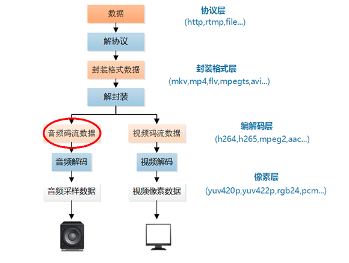
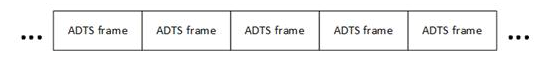

音频码流在视频播放器中的位置如下所示


本文中的程序是一个AAC码流解析程序。该程序可以从AAC码流中分析得到它的基本单元ADTS frame，并且可以简单解析ADTS frame首部的字段。通过修改该程序可以实现不同的AAC码流处理功能。

# 1.原理
AAC原始码流（又称为“裸流”）是由一个一个的ADTS frame组成的。他们的结构如下图所示。



其中每个ADTS frame之间通过syncword(同步字)进行分隔。同步字为0xFFF（二进制“111111111111”）。AAC码流解析的步骤就是首先从码流中搜索0x0FFF，分离出ADTS frame；然后再分析ADTS frame的首部各个字段。本文的程序即实现了上述的两个步骤。

# 2.代码

`整个程序位于simplest_aac_parser()函数中，如下所示。

```c
#include <stdio.h>
#include <stdlib.h>
#include <string.h>

int getADTSframe(unsigned char*buffer,int buf_size,unsigned char*data,int*data_size){
	int size=0;
	if(!buffer||!data||!data_size){
		return -1;
	}
	while(1){
		if(buf_size<7){
			return -1;
		}
		//sync words
		if(buffer[0]==0xff &&(buffer[1] &0xf0)==0xf0){
			//high 2 bit
			size|=((bufer[3]&0x03)<<11);
			size|=buffer[4]<<3;
			size|=((buffer[5] & 0xe0)<<5);
			break;
		}
		--buf_size;
		++buffer;
	}
	if(buf_size < size){
		return 1;
	}
	memcpy(data,buffer,size);
	*data_size=size;
	return 0;
}
int simple_aac_parser(char* url){
	int data_size=0;
	int size=0;
	int cnt=0;
	int offset=0;
	
	//FILE *myout=fopen("output_log.txt","wb+");
	FILE*myout=stdout;
	
	unsigned char* aacframe=(unsigned char*)malloc(1024*5);
	unsigned char*aacbuffer=(unsigned char*)malloc(1024*1024);
	FILE* ifile=fopen(url,"rb");
	if(!ifile){
		printf("Open file error");
		return -1;
	}
	printf("-----+- ADTS Frame Table -+------+\n");
	printf(" NUM | Profile | Frequency| Size |\n");
	printf("-----+---------+----------+------+\n");
	while(!feof(ifile)){
		data_size=fread(aacbuffer+offset,1,1024*1024-offset,ifile);
		unsigned char*input_data=aacbuffer;
		while(1){
			int ret=getADTSframe(input_data,data_size,aaacframe,&size);
			if(ret==-1){
				break;
			}else if(ret==1){
				memcpy(aacbuffer,input_data,data_size);
				break;
			}
			char profile_str[10]={0};
			char frequence_str[10]={0};
			
			unsigned char profile=aacfrme[2]&0xC0;
			profile=profile>>6;
			switch(profile){
			case 0:sprintf(profile_str,"Main");break;
			case 1:sprintf(profile_str,"LC");break;
			case 2:sprintf(profile_str,"SSR");break;
			default:sprintf(profile_str,"unknow");break;
			}
			
			unsigned char simpling_frequency_index=aacframe[2]&0x3C;
			sampling_frequency_index=sampling_frequency_index>>2;
			switch(sampling_frequency_index){
			casa 0:sprintf(frequency_str,"960000Hz");break;
			case 1:sprintf(frequency_str,"88200Hz");break;
			case 2: sprintf(frequence_str,"64000Hz");break;
			case 3: sprintf(frequence_str,"48000Hz");break;
			case 4: sprintf(frequence_str,"44100Hz");break;
			case 5: sprintf(frequence_str,"32000Hz");break;
			case 6: sprintf(frequence_str,"24000Hz");break;
			case 7: sprintf(frequence_str,"22050Hz");break;
			case 8: sprintf(frequence_str,"16000Hz");break;
			case 9: sprintf(frequence_str,"12000Hz");break;
			case 10: sprintf(frequence_str,"11025Hz");break;
			case 11: sprintf(frequence_str,"8000Hz");break;
			default:sprintf(frequence_str,"unknown");break;
			}
			fprintf(myout,"%5d| %8s|  %8s| %5d|\n",cnt,profile_str ,frequence_str,size);

			data_size-=size;
			input_data+=size;
			cnt++;
		}
	}
	fclose(ifile);
	free(aacbuffer);
	free(aacframe);
		
	return 0;
}
```

函数调用的方法：`simple_aac_parser("nocturne.aac");`