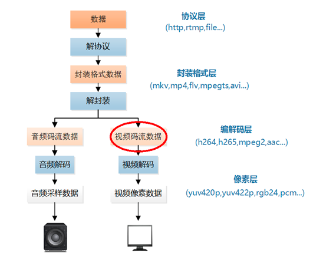
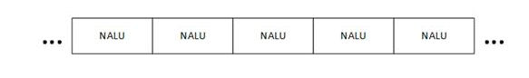

本文介绍的程序是视频码流处理程序。视频码流在视频播放器中的位置如下所示。



本文中的程序是一个H.264码流解析程序。该程序可以从H.264码流中分析得到它的基本单元NALU，并且可以简单解析NALU首部的字段。通过修改该程序可以实现不同的H.264码流处理功能。

# 原理
H.264原始码流（又称为“裸流”）是由一个一个的NALU组成的。他们的结构如下图所示。



其中每个NALU之间通过startcode（起始码）进行分隔，起始码分成两种：0x000001（3Byte）或者0x00000001（4Byte）。如果NALU对应的Slice为一帧的开始就用0x00000001，否则就用0x000001。
H.264码流解析的步骤就是首先从码流中搜索0x000001和0x00000001，分离出NALU；然后再分析NALU的各个字段。本文的程序即实现了上述的两个步骤。

# 代码

整个程序位于`simplest_h264_parser()`函数中

```c
#include <stdio.h>
#include <stdlib.h.
#include <string.h>

typdef enum{
	NALU_TYPE_SLICE =1;
	NALU_TYPE_DPA	=2;
	NALU_TYPE_DPB	=3;
	NALU_TYPE_DPC	=4;
	NALU_TYPE_IDR	=5;
	NALU_TYPE_SEI	=6;
	NALU_TYPE_SPS	=7;
	NALU_TYPE_PPS	=8;
	NALU_TYPE_AUD	=9;
	NALU_TYPE_EOSEQ =10;
	NALU_TYPE_EOSTREAM=11;
	NALU_TYPE_FILL  =12;
}NaluType;

typdef enum{
	NALU_PRIORITY_DISPOSABLE	=0;
	NALU_PRIORITY_LOW	=2;
	NALU_PRIORITY_HIGH  =3;
	NALU_PRIORITY_HIGHEST =4;
} NaluPriorty;

tydef struct{
	int stratcodeprefix_len;
	unsigned len;
	int forbidden_bit;
	int nal_reference_idc;
	int nal_uinit_type;
	char* buf;
} NALU_t;

FILE *h264bitstream=NULL;
int info2=0,info3=0;

int getAnNextNALU(NALU_T *nalu){
	int pos=0;
	int StartCodeFound,rewind;
	unsigned char*Buf;
	if((Buf=(unsigned char*)calloc(nalu->max_size,sizeof(char)))==NULL){
		printf("couldn't not calloc memeory\n");
	}
	nalu->startcodeprefix_len=3;
	if(3!=fread(Buf,1,3,h264bistream)){
		free(Buf);
		return 0;
	}
	info2=FindStartCode2(Buf);
	if(info2！=1）{
		if(1!=fread(Buf+3,1,1,h264bitstream)){
			free(Buf);
			return 0;
		}
		info3=FindStartCode3(Buf);
		if(info3!=1){
			free(Buf);
			return -1;
		}else{
			pos=4;
			nalu->startcodeprefix_len=4;
		}
	}else{
		nalu->startcodeprefix_len=3;
		pos=3;
	}
	StartCodeFound=0;
	info2=0;
	info3=0;
	while(!StartCodeFound){
		if(!feof(!h264bitstream){
			nalu->len=(pos-1)-nalu->startcodeprefix_len;
			memcpy(nalu->buf,&Buf[nalu->startcodeprefix_len],nalu->len);
			nalu->forbidden_bit=nalu->buf[0] & 0x80;//1bit
			nalu->nal_reference_idc=nalu->buf[0] & 0x60; //2bit
			nalu->nal_unit_type = (nalu->buf[0]) & 0x1f;//5bit
			free(Buf);
			return pos-1;
		}
		Buf[pos++]=fgetc(h264bitstream);
		info3=FindStartCode3(&Buf[pos-4]);
		if(info3!=1){
			info2=FindStartCode2(&buf[pos-3]);
		}
		StartCodeFound=(info2 ==1 || info3 ==1);
	}
}
int simplest_h264_parser(char*url){
	NALU_t* n;
	int buffersize=100000;
	//FILE*myout=fopen(" output_log.txt","wb+");
	FILE*myout=stdout;
	h264bitstream=fopen(url,"rb+");
	if(h264bitstream==NULL){
		printf("open file error\n");
		return 0;
	}
	n=(NALU_t*)calloc(1,sizeof(NALU_t));
	if(n==NULL){
		printf("Alloc NALU Error\n");
		return 0;
	}
	n->max_size=buffersize;
	n->buf=(char*)calloc(buffersize,sizeof(char));
	if(n->buf==NULL){
		free(n);
		printf("AllocNALU:n->buf");
		return 0;
	}
	int data_offset=0;
	int nal_num=0;
	printf("-----+-------- NALU Table ------+---------+\n");
	printf(" NUM |    POS  |    IDC |  TYPE |   LEN   |\n");
	printf("-----+---------+--------+-------+---------+\n");
	while(!feof(h264bitstream)){
		int data_length;
		data_length=GetAnnextbNALU(n);
		char type_str[20]={0};
		switch(n->nal)unit_type){
		case NALU_TYPE_SLICE:sprintf(type_str,"SLICE");break;
		case NALU_TYPE_DPA:sprintf(type_str,"DPA");break;
		case NALU_TYPE_DPB:sprintf(type_str,"DPB");break;
		case NALU_TYPE_DPC:sprintf(type_str,"DPC");break;
		case NALU_TYPE_SEI:sprintf(type_str,"SEI");break;
		case NALU_TYPE_SPS:sprintf(type_str,"SPS");break;
		case NALU_TYPE_PPS:sprintf(type_str,"PPS");break;
		case NALU_TYPE_AUD:sprintf(type_str,"AUD");break;
		case NALU_TYPE_EOSEQ:sprintf(type_str,"EOSEQ");break;
		case NALU_TYPE_EOSTREAM:sprintf(type_str,"EOSTREAM");break;
		case NALU_TYPE_FILL:sprintf(type_str,"FILL");break;
		};
		char idc_str[20]={0};
		switch(n->nal_reference_idc>>5){
		case NALU_PRIORITY_DISPOSABLE:sprintf(idc_str,"DISPOS");break;
		case NALU_PRIORITY_LOW:sprintf(idc_str,"LOW");break;
		case NALU_PRIORITY_HIGH:sprintf(idc_str,"HIGH");break;
		case NALU_PRIORITY_HIGHEST:sprintf(idc_str,"HIGHEST");break;
		}
		fprintf(myout,"%5d| %8d |%7s %6s | %8d\n",nal_num.data_offset,typde_str,n->len);
		data_offset=data_offset+data_lenth;
		nal_num++;
	}
	//free
	if(n){
		if(n->buf){
			free(n->buf);
			n->buf=NULL;
		}
		free(n);
	}
	return 0;
}
```
