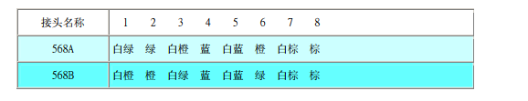
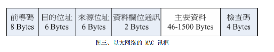

# 1.网路
## 1.1 什么是网络
网络就是几部计算机主机或者是网络打印机之类的接口设备，**透过网路线**或者是**无线网络的技术**，将这些设备连接起来，使得数据可以透过网路媒体(网络线以及其它网络卡等硬件)来传输的一种方式。
## 1.2 以太网
网络硬件包括有最常见的以太网，还有速度算是最快的光纤网络，还有蓝牙无线技术以及ATM（Asychronronous Transfer Mode）等硬件接口。

1.**以太网的速度**：IEEE定制以太网标准为 802.3的IEEE 10BASE5
* 10：代表传输速度为10Mbps
* BASE:采用基频信号来进行传输
* 5：每个网络节点之间最长可达500公里

2.**网络传输信息**：就是**0与1**

3.**网线**：以前是用双绞线，目前支持四绞线就是现在常见的八芯网络线。这种网络线被称为等级五(Category 5,CAT5),这种传输速度的以外网被称为Fast ethernet。Gigabit网络速度达到1000Mbps，就是Gigabit ethernet，Gigabit ethernet网络线更加精良。

因为当传输速度增加时，线材电磁效应相互加扰会加强，制作网络线时候注意线材质以及内部线芯之间缠绕情况配置等，降低电磁干扰，才能达到Gigbit。还需要网络卡升级，主机与主机之间网络线，以及连接主机线路的集线器/交换机等都必须提升到可以支持gigabit速度等级设备才行。

4.**网络线接头**：目前最常见的是RJ-45网络接头，共有八芯接头。

接头因为线芯对应不同分为568A与5688接头

实际使用只有1,2,3,6。其他特殊用途。由于接头不同网络线又可分为：

* 并行线：两线同为568A，连结主机网络与集线器之间材料
* 跳线：一边568A，一边5688，直接连接两部主机的网络卡

5.**传输数据**：目前办公室大多数是以利用集线器以及交换机(Hub/Switch)作为中心，利用星形联机达到网络环境的一种方式。

网络线是电子信号0与1，同时有两部计算机要使用这个网络线，怎么可能同时发出两个电子信号，**会发生讯号碰撞的问题**。**网络共享媒体(包括网络线，集线器等)，在单一时间点内，仅能被一部主机所使用**。

解决碰撞委托，使用CSMA/CD技术。

6.**数据传递过程**：使用MAC(Media Access Control)来管理数据传送的。一个MAC看成一个帧Frame。这个帧是整个硬件上面传输数据的最小单位。

网络线类似独木桥，MAC看成一个人，一次只能过一个，这个桥怎么连接的。

其中最重要6个Bytes目的与来源地址了。
## 1.3 OSI七层协定
# 2.IP 与 MAC
## 2.1传输单位与MAC
## 2.2IP的组成
## 2.3网域的概念与IP
## 2.4Netmask的用途与子网络的切分
## 2.5IP的种类与取得方式
## IP的封包的表头
# 3.网络层之路由概念
## 3.1 什么是路由
##　3.2 观察主机的路由
# 4. 常见通讯协议
# 4.1TCP协议
# 4.2 UDP协议
# 4.3 ICMP协定
# 4.4 MTU的限制
# 4.5 封包过滤的防火墙概念
# 5.连上Internet前准备事项
# 5.1 什么是主机名称与DNS
# 5.2 一组可以连上 Internet的必要网络参数