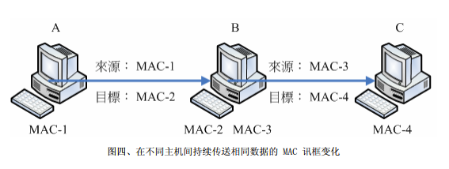
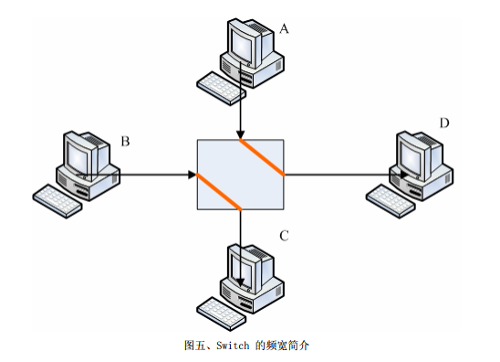
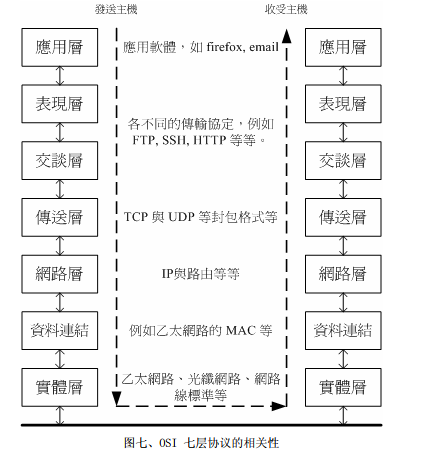
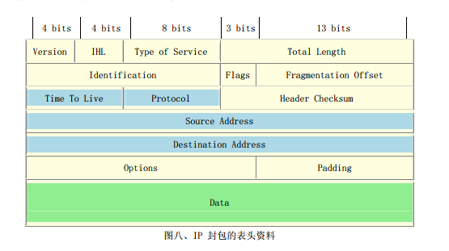
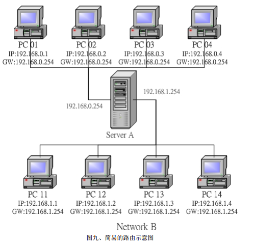
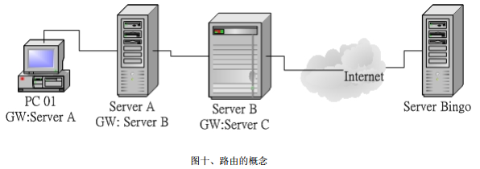

# 1.网路
## 1.1 什么是网络
网络就是几部计算机主机或者是网络打印机之类的接口设备，**透过网路线**或者是**无线网络的技术**，将这些设备连接起来，使得数据可以透过网路媒体(网络线以及其它网络卡等硬件)来传输的一种方式。
## 1.2 以太网
网络硬件包括有最常见的以太网，还有速度算是最快的光纤网络，还有蓝牙无线技术以及ATM（Asychronronous Transfer Mode）等硬件接口。

1.**以太网的速度**：IEEE定制以太网标准为 802.3的IEEE 10BASE5
* 10：代表传输速度为10Mbps
* BASE:采用基频信号来进行传输
* 5：每个网络节点之间最长可达500公里

2.**网络传输信息**：就是**0与1**

3.**网线**：以前是用双绞线，目前支持四绞线就是现在常见的八芯网络线。这种网络线被称为等级五(Category 5,CAT5),这种传输速度的以外网被称为Fast ethernet。Gigabit网络速度达到1000Mbps，就是Gigabit ethernet，Gigabit ethernet网络线更加精良。

因为当传输速度增加时，线材电磁效应相互加扰会加强，制作网络线时候注意线材质以及内部线芯之间缠绕情况配置等，降低电磁干扰，才能达到Gigbit。还需要网络卡升级，主机与主机之间网络线，以及连接主机线路的集线器/交换机等都必须提升到可以支持gigabit速度等级设备才行。

4.**网络线接头**：目前最常见的是RJ-45网络接头，共有八芯接头。

接头因为线芯对应不同分为568A与5688接头


实际使用只有1,2,3,6。其他特殊用途。由于接头不同网络线又可分为：

* 并行线：两线同为568A，连结主机网络与集线器之间材料
* 跳线：一边568A，一边5688，直接连接两部主机的网络卡

5.**传输数据**：目前办公室大多数是以利用集线器以及交换机(Hub/Switch)作为中心，利用星形联机达到网络环境的一种方式。

网络线是电子信号0与1，同时有两部计算机要使用这个网络线，怎么可能同时发出两个电子信号，**会发生讯号碰撞的问题**。**网络共享媒体(包括网络线，集线器等)，在单一时间点内，仅能被一部主机所使用**。

解决碰撞委托，使用CSMA/CD技术。

6.**数据传递过程**：使用MAC(Media Access Control)来管理数据传送的。一个MAC看成一个帧Frame。这个帧是整个硬件上面传输数据的最小单位。

网络线类似独木桥，MAC看成一个人，一次只能过一个，这个桥怎么连接的。


其中最重要6个Bytes**目的**与**源**地址了。在所有的以太网络卡当中都有一个独一无二的**网络卡卡号**，就是上面的**目的与源地址**,这个地址是硬件地址公有6Bytes，分别有`00:00:00:00:00:00:00:00`到`FF:FF:FF:FF:FF:FF:FF:FF`,前3Bytes为厂商代码，后3Bytes改厂商自行设定装置码了。MAC通常和网卡卡号有关，通常将MAC作为网络卡卡号的代称。

**注意**:这个MAC传送，仅在局域网内生效，如果跨不同的网域(这个和IP有关)，那么来源于目的地址就会跟着改变。



MAC-1不能与MAC-3与MAC-4胡同，因为MAC-1这块网路卡并没有与MAC-3及MAC-4使用同样的`SWITCH/HUB`互接。
* 1.先由MAC-1传送到MAC-2来源是MAC-1而目的地是MAC-2
* 2.B计算机接收后，查看该讯框，发现目标其实是C计算机。通过MAC-3与MAC-4进行交互。

也就是通过B（**就是路由器**）才将封包送到另一个网域去的时候，frame内的硬件地址就会被改变，让后才能够在同一个网域里面进行frame流通。

* 3.**传输的容量**：以太网中，一个讯框最大容量为1500Bytes（**带宽的单位是位bit，下载的单位是字节就是8倍关系**）。如果是100M Bytes讯框后，传送到目的端先分解传输，然后重新组合成原来100MBytes档案。
	* 网络共享媒体一次只能有一部主机使用
	* 局部网络内的两部计算机可以同时下载

原因：每次发出一个讯框，都需要进行CSMA/CD的监听，而刚刚成功发出讯框的那部主机，也需要再使用CSMA/CD来跟大家抢。回产生frame与frame可能会碰撞。

大网络的情况下支持大的Jumbo Frame。能达到9000bytes。

* 4.**集线器还是交换器**：网络共享媒体可能发生碰撞，因为CSMA/CD的缘故。星形联机汇总，**Hub网络共享媒体**，Hub仅是将所有来自PC的frame再次送出去给所有的PC而已。switch则不是，switch内部具有为处理器以及内存，内存记录switch port与其他连接PC的MAC地址，多以来自switch两端PC要互传数据，每个frame将不会透过CSMA/CD监听，而是透过switch直接将该frame送到目标主机头上去。

switch不是共享媒体，且switch的每端口都具有独立的频宽。

* `10/100`的Hub上连结5部主机，那么整个`10/100Mbps`分给这个五部主机，五部总共是`10/100Mbps`
* switch中每个port都有`10/100Mbps`频宽。



* A传到D与B传送到C都独自拥有`10/100Mbps`频宽，互不影响。如果A与D都传给C，由于Cport就仅有`10/100Mbps`,等于A与D需要抢`10/100Mbps`来用的意思。

总之：switch克服碰撞问题，因为有个switch port对应MAC的相关功能，所以switch并非共享媒体。现在switch规格很多，选购时候，支持`全双工/半双工`,和支持Jumbo frame为佳。
## 1.3 OSI七层协定

|分层|负责内容|
|--|--|
|实体层1|网络硬件标准，网络线、各种无线联机方式，各种硬件标准有关大多数都在这个层级中定义|
|数据链路层|需要使用电子讯号进行传送，定制各种动态frame。frame数据包括数据格式、错误控制、流量控制、检查数据传输错误方式（ARP）协议将MAC于IP相关联|
|网络层3|**Ip层**，定义计算机之间联机建立、终止与维持等，数据封包(packet)传输路径选择等等，封包能否到达目的地的**路由**(route)概率|
|传送层4|发送端与接收端联机技术(TCP技术)，封包格式，确保传输无误|
|会谈层5|两个地址之间的联机信道之连接与挂断，加强网络管理，签到，签退，对谈之控制等等|
|表现层6|应用程序制作出来的数据格式不一定符合网络传输标准编码格式，这层：将来及应用数据重新编码成网络标准格式，这个层级主要定义网络服务之间数据格式转换，包括数据的加密也是在这个层上面处理|
|应用层|完全与程序有关，程序包括浏览器，数据库处理系统，电子邮件系统等|

* 七层中前两层是硬件标准规范出来的，MAC讯框相关格式，以太网网线接头规范等。
* 网络层与传输层TCP/IP有关。目前的Internet相关的IP与TCP封包格式是由INTERNIC所统一整理与维护的，至于TCP/IP是由RFC技术报告形式公开。
* 会谈、表现与应用层则主要与操作系统及应用程序有关系了。


# 2.IP 与 MAC
网络相关的硬件：最常见网络硬件接口为以太网，包括网络线、网络卡、Hub/Switch等，以太网络上面的传输使用网络卡号为基准的MAC帧，配合CSMA/CD监听技术来传送讯框，这是硬件部分。

网络相关软件部分：Internet其实就是TCP/IP这个通讯协议的通称，Internet是INTERNIC统一管理的，其实负责分配Internet上面IP以及提供相关TCP/IP技术文件而已，另外TCP/IP上面还是很多的应用程序，包括FTP,HTTP,EMAIL等技术
## 2.1传输单位与MAC
ISP（Internet Services Provider）网络运行商。IP与MAC通过一个解析ARP。

当主机想找到IP时，就会对整个局域网进行广播封包，局域网内会对这个包进行回包。`arp -n`
## 2.2IP的组成
IP是一个数据封包格式，这个IP数据包最大可达到65535bytes,底层MAC帧只能1500bytes，IP包是支持重组的。MAC表头是MAC地址，IP表头就是IP地址了。32bits组成,IPV4.
用四个字节表示，便于识别

```
ip的表示形式：
0000000.0000000.0000000.0000000 ==>0.0.0.0
1111111.1111111.11111111.11111111 ==>255.255.255.255
```
## 2.3网域的概念与IP
IP的32位分别由HOST_ID与Net_ID两部分组成,网域(网段)为(192.168.0)距离C class网域作为说明:

```
192.168.0.0~192.168.0.255   这个C Class说明
11000000.10101000.0000000.00000000
11000000.10101000.0000000.11111111
|----------Net_Id--------|-host--|
```

* net_id内不能有相同的Host_id,否则ip冲突
* 同一网段内net_id不变，host_id不可重复，host_id不能为0或全1.网段内可用设定主机IP是[1,254]
* 统一网域内，每一部主机都可以透过MAC讯框的格式传递资料，特过ARP协议与广播封包取得MAC与IP的对应后，直接利用MAC讯框传递数据
* 同一物理网段内，两部主机设定不同的IP网段，两部主机无法直接以MAC讯框格式进行数据传递，因为广播封包无法查询到MAC与IP对应
* Host_ID占用位越多，数量越多.

设定在同一网域内，每一部计算机直接透过MAC来进行数据交流，不必经过Router（路由器）来进行封包的传递.

**IP的分级**:目前Internet将IP简单分为三种常见的等级。A,B,C class。

```
以二进制说明Network 第一个数字的定义:

A class:0xxxxxxx.xxxxxxxx.xxxxxxx.xxxxxxx ==>Net_D的开头是0
	    |--net--|----------host---------|
B class:10xxxxxx.xxxxxxxx.xxxxxxx.xxxxxxx ==>Net_D的开头是10
	    |-----net--------|--host--------|
C class:110xxxxxx.xxxxxxxx.xxxxxxx.xxxxxxx ==>Net_D的开头是110
	    |--net--|----------host---------|

三种分级在十进制表示：
A Class:0.xx.xx.xx~126.xx.xx.xx
B Class:128.xx.xx.xx~191.xx.xx.xx
C Class:192.xx.xx.xx~223.xx.xx.xx
```
`127.xx.xx.xx`这个网络断被拿去给操作系统作为内部循环网络(loopback)：

* 不管主机硬件有没有网络卡，确认自己网络没有问题，这个A Class网络段拿到操作系统中，作为内部回路测试。
## 2.4Netmask的用途与子网络的切分
可以让一位net_id给host_id进行使用。C class中net_id就有25位原来的C Class网域被分割成两个网域，每个网域有256/2-s=128个可用IP。这样对于网络效能还是有点好处的。

**分割**：使用Netmask(子网掩码)来达到网络切分。既然Net_Id不可变，假设占据bits已经被用光了(全部为1).

```
192.168.0.0~192.168.0.255  这个C Class的Netmask说明
110000000.00000000.00000000.00000000
110000000.00000000.00000000.00000000
|---------net_id-----------|--host--|
111111111.11111111.11111111.11111111  ==> netmask 二进制
   255   .   255  .  255   . 255      ==>十进制
```
那么 A,B, C Class 的 Netmask 表示就成为这样：

```
Class A,B,C 三个等级的Netmask表示方式：
A Class:11111111.00000000.000000000.0000000  ==>255.0.0.0
B Class:11111111.11111111.000000000.000000000  ==>255.255.0.0
C Class:1111111.11111111.1111111.00000000  ==>255.255.255.0
```
Host_ID全部为0以及全部为1的时候该IP是不可以使用的。全部为0表示IP是该网段的Network，最后一个IP称为Broadcast，参数有：

```
Netmask:  255.255.255.0  <==网域定义中，最重要参数
Network： 192.168.0.0    <== 第一个IP
Broadcast:192.168.0.255  <== 最后一个IP
可用以设定成为主机的IP数：
192.168.0.1~ 192.168.0.254
```
一般知道Network以及Netmask之后，就可以定义出改网段的所有IP了。常用下面写法表示：

```
Network/Netmask
192.168.0.0/255.255.255.0
192.168.0.0/24     <==因为net_id共有24个bits
```
 如果在进行分割，使用net_id为25位：

```
原来的C Class的Net_ID与Host_id分别：
11000000.101010000.00000000.000000000 Network: 192.168.0.0
11000000.101010000.00000000.111111111   Broadcast: 192.168.0.255
|---------net_id-----------|--host--|

切成两个子网络之后的Net_id与host_id：
110000000.101010000.00000000.0 00000000   多了一个net_id为0
110000000.101010000.00000000.1 00000000   多一个net_id为1
|--------net_id---------------|-host-|

第一个子网络：
Network:   110000000.1010100000.000000000.0 000000000  192.168.0.0
Broadcast: 11000000.1010100000.0000000000.0 111111111  192.168.0.127
		   |------------net_id------------|---host--|
Netmask:   1111111111.111111111.111111111.1 000000000  255.255.255.128

第二个子网络：
Network:   110000000.1010100000.000000000.1 000000000  192.168.0.128
Broadcast: 11000000.1010100000.0000000000.1 111111111  192.168.0.255
		   |------------net_id------------|---host--|
Netmask:   1111111111.111111111.111111111.1 000000000  255.255.255.128
所有IP表示的网络：
192.168.0.128/25或192.168.0.128/255.255.255.128
```
## 2.5IP的种类与取得方式
IP的种类，IPv4中只有两种IP类别：

* public IP:公共IP，由INTERNIC所统一规划的IP，有这种IP才可以连上Internet
* private IP:私有IP或保留IP，不能直接连上Internet的IP，主要用于局域网内的主机联机规划。

私有IP也分别A,B,C三个Class当中各保留一段作为私有IP网段：

* A Class:`10.0.0.0-10.255.255.255`
* B Class:`172.16.0.0-172.31.255.255`
* C Class:`192.168.0.0-192.168.255.255`

私有IP，不能直接访问Internet，有下面几个限制：

* 私有地址的路由信息不能对外播散(内部网络)
* 私有地址作为来源或目的地址封包，不能透过Internet来转送
* 关于私有地址的参考记录(如DNS)，只能限于内部网络使用.

使用私有IP送上Internet，需要一个简单防火墙加上NAT(Network Address Transfer)主机设定，就可以透过IP伪装来使用你私有IP计算机可以连接上Internet。

IP的取得方式：

* 固定手动设定(static):固定取得Public IP
* 浮动式拨接（ADSL）：调制解调器拨接，这种获得IP方式是ISP随机提供的，因此每次接到ISP后取得IP可能不是固定的，有人取得IP方式浮动式
* 缆线(cable modem):使用单向或双向Cable，可以像ISP注册取得Public IP
## IP的封包的表头
IP数据封包需要放置在MAC讯框里面。IP包如下所示：



表头注意，每行都是32bits，表头内容：

* version:IP封包的版本。惯用IPv4这个版本
* IHL（Internet Header Lenght,IP表头长度）：5~15
* Type of Service(服务类型)
* total length:IP封包总容量，表头与内容(data)部分，最大可达到65535bytes
* identification(辨识码)。分割成小的包的时候，使用这个辨识码
* flags:特殊标识
* fragment offset:分段偏移
* time to live(TTL,存活时间)：表示这个IP封包存活时间，范围0-255，当这个IP封包通过一个路由器时，TTL减一，当TTL为0是，这个封包被直接丢弃
* protocol number(协定代码):网络上面封包协议多了，每个协定都是装在IP当中的，所以IP就得在表头上面告知接受端。一个IP内含有数据是什么协议才行:


|IP内的号码|协议名称(全名)|
|--|--|
|1|ICMP internet control message protocol|
|2|IGMP internet group management protocol|
|3|GGP gateway-to-gateway protocol|
|4|IP ip in ip encapsulation|
|6|TCP transmission control protocl|
|8|EGP exterior gateway protocol|
|17|UDP user datagram protocol|

* Header checksum:表头检查吗
* source address:来源IP地址
* destination address:目标IP地址
* options其他选项
* padding补齐项目
# 3.网络层之路由概念
同一网域内可以直接使用广播的方式以ARP协议来取得IP与MAC的对应，好让资料在同一个网域内进行传输。想要在非同一网域主机交互数据，需要路由(route)，网络层.
## 3.1 什么是路由
两个不同网段，Network A与Network B经过路由来进行数据传递(Server A).PC01传递数据到P11。



路由表(route table):**每部主机都有自己的路由表**，PC01传递到PC02的？

* 1.当PC01有IP封包需要传递传送时，主机会查阅IP分包表头的目标IP地址
* 2.PC01主机分子自己的路由表，当发现目标IP与本机IP的net_id相同(同一个网域)，则PC01会参考本省的ARP记录，而直接利用MAC来互相传递消息
* 3.PC01与PC11并非同一网域，因此PC01会分析路由表是否符合的路由设定，如果没有的话，就直接IP封包送到预设路由表(default gateway)上头去，在本案例中defaut gateway则是Server A这一步
* 4.当IP封包被送至Server A后，Server A同样分析IP封包的目标地址，然后Server A自己路由设定，通常Server A作为路由器的主机，都会拥有两个以上的接口来沟通不同的网域的。在这个案例当中，Server A会发现这个IP目标是192.168.1.11.刚好是Network B这个相同的网络段区域，因此Server A会直接有以MAC讯框将数据传送给P11去。

每一部主机里面都会存在这一个路由表(route table)，数据的传递将依据这个路由表进行传递。一旦封装包已经由路由表的规则传递出去，主机本身就已经不再管封包流向了，因为该封包的流向将是下一个主机(那部Router)来进行传递，而Router在传递时，依据Router自己路由来判断对该封包应该由哪里传递出去的



PC01要将资料送到Server Bingo去，依据自己的路由表，将该封包送到Server A去，Server A再继续送到Server B，然后一个一个接力给他送下去，最后总是可以达到Server Bingo的

`Gateway/Router`:`网关/路由器`功能就是负责不同网域之间的封包转递(IP Forwarder),由于路由器具有IP Forwarder的功能，并且具有管理路由的能力，所以可以讲不同网络之间封装包进行转递功能。此外，主机与设定的Gateway必定在同一个网段.
##　3.2 观察主机的路由
路由一旦错误，将会造成某些封包完全无法正确的送出去。所以我们当然需要好好的来观察一下我们主机的路由表。

```
#route -n
Kernel IP routing table
Destination     Gateway         Genmask         Flags Metric Ref    Use Iface
192.168.99.0    0.0.0.0         255.255.255.0   U     0      0        0 p4p2
192.168.61.0    0.0.0.0         255.255.255.0   U     0      0        0 p4p1
169.254.0.0     0.0.0.0         255.255.0.0     U     1002   0        0 p4p1
169.254.0.0     0.0.0.0         255.255.0.0     U     1003   0        0 p4p2
172.17.0.0      0.0.0.0         255.255.0.0     U     0      0        0 docker0
0.0.0.0         192.168.61.1    0.0.0.0         UG    0      0        0 p4p1

# destination:network意思
# gateway: 该接口的Gateway那个IP。若为0.0.0.0表示不需要额外的IP
#genmask： netmask
# flag: 公有多个可以有俩表示网域或主机代表意义
#     U：代表该路由可用
#     G：代表该网域需要经由Gateway来帮忙转递
#     H：代表该行路由为一部主机，非一个整个网域
#iface: 就是Interface（接口）意思
```
# 4. 常见通讯协议
# 4.1TCP协议
# 4.2 UDP协议
# 4.3 ICMP协定
# 4.4 MTU的限制
# 4.5 封包过滤的防火墙概念
# 5.连上Internet前准备事项
# 5.1 什么是主机名称与DNS
# 5.2 一组可以连上 Internet的必要网络参数