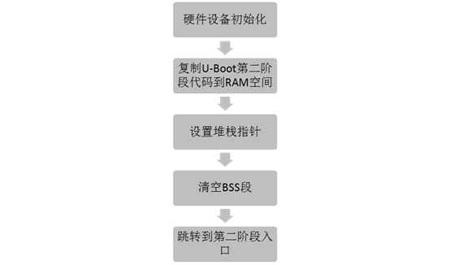
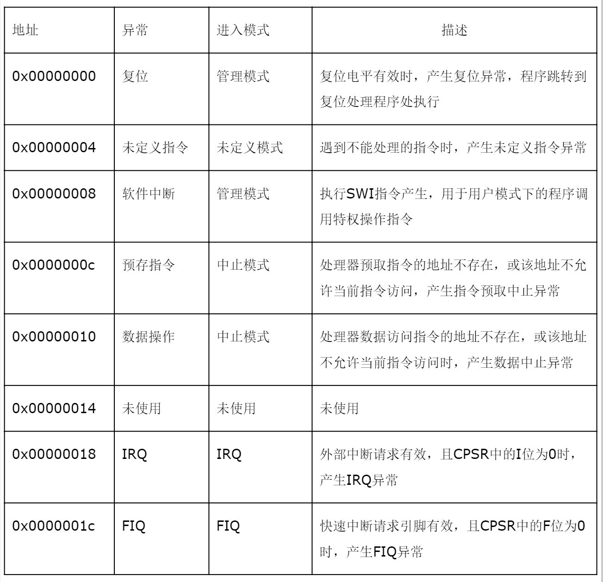
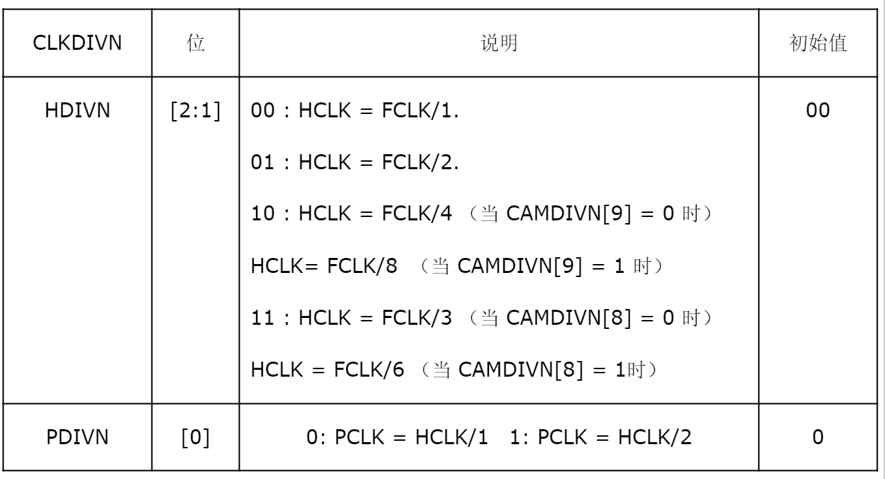
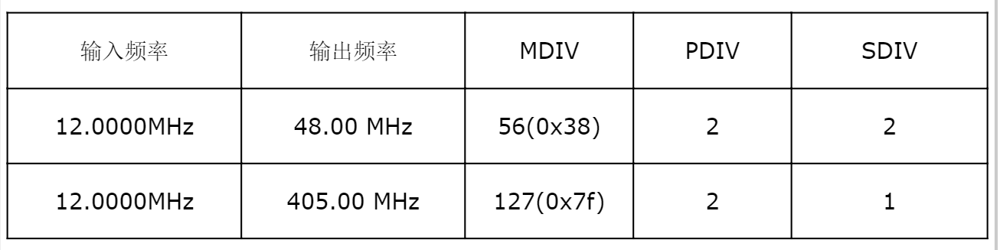
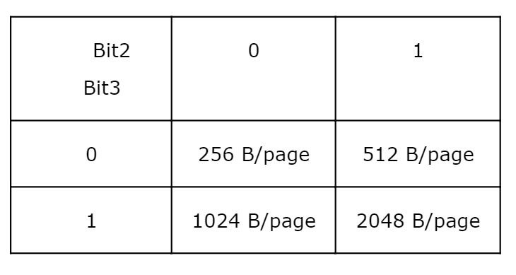
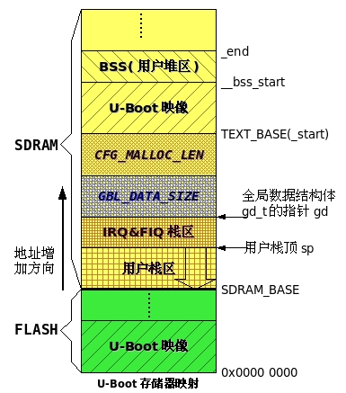
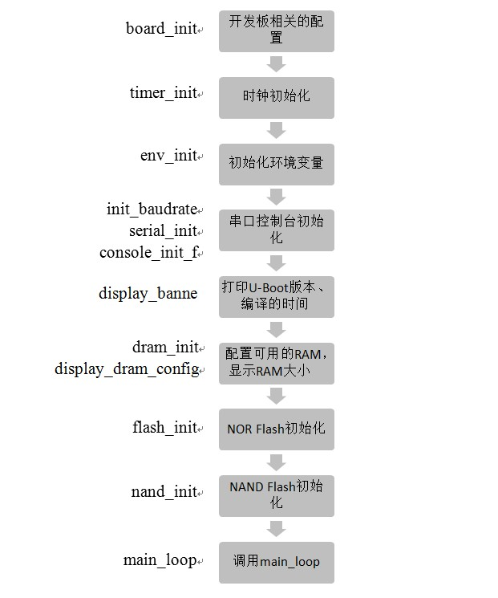

# 1.U-Boot工作过程
第一阶段的功能

* 1.硬件设备初始化
* 2.加载U-Boot第二阶段代码到RAM空间
* 3.设置好栈
* 4.跳转到第二阶段代码入口

第二阶段的功能

* 1.初始化本阶段使用的硬件设备
* 2.检测系统内存映射
* 3.将内核从Flash读取到RAM中
* 4.为内核设置启动参数
* 5.调用内核

# 2.U-Boot启动第一阶段代码分析
第一阶段对应的文件是`cpu/arm920t/start.S`和`board/samsung/mini2440/lowlevel_init.S`。

U-Boot启动第一阶段流程如下：



根据`cpu/arm920t/u-boot.lds`中指定的连接方式：

```
ENTRY(_start)
SECTIONS
{
       . = 0x00000000;
       . = ALIGN(4);
       .text :
       {

           cpu/arm920t/start.o                    (.text)
           board/samsung/mini2440/lowlevel_init.o (.text)
           board/samsung/mini2440/nand_read.o     (.text)
           *(.text)

       }

       … …

}
```
第一个链接的是`cpu/arm920t/start.o`，因此u-boot.bin的入口代码在`cpu/arm920t/start.o`中，其源代码在`cpu/arm920t/start.S`中。下面我们来分析`cpu/arm920t/start.S`的执行。

## 2.1 硬件设备初始化
### 2.1.1 设置异常向量
`cpu/arm920t/start.S`开头有如下的代码：

```
.globl _start
_start:    b     start_code              /* 复位 */
       ldr   pc, _undefined_instruction  /* 未定义指令向量 */
       ldr   pc, _software_interrupt     /* 软件中断向量 */
       ldr   pc, _prefetch_abort         /* 预取指令异常向量 */
       ldr   pc, _data_abort             /* 数据操作异常向量 */
       ldr   pc, _not_used               /* 未使用   */
       ldr   pc, _irq                    /* irq中断向量  */
       ldr   pc, _fiq                    /* fiq中断向量  */
/*  中断向量表入口地址 */
_undefined_instruction:    .word undefined_instruction
_software_interrupt:       .word software_interrupt
_prefetch_abort:           .word prefetch_abort
_data_abort:               .word data_abort
_not_used:                 .word not_used
_irq:                      .word irq
_fiq:                      .word fiq
       .balignl 16,0xdeadbeef
```

以上代码设置了ARM异常向量表，各个异常向量介绍如下:


在`cpu/arm920t/start.S`中还有这些异常对应的异常处理程序。当一个异常产生时，CPU根据异常号在异常向量表中找到对应的异常向量，然后执行异常向量处的跳转指令，CPU就跳转到对应的异常处理程序执行。

其中**复位异常向量**的指令“b start_code”决定了U-Boot启动后将自动跳转到标号“start_code”处执行。

### 2.1.2 CPU进入SVC模式

```
start_code:
       /*
        * set the cpu to SVC32 mode
        */
       mrs r0, cpsr
       bic r0, r0, #0x1f    /*工作模式位清零 */
       orr r0, r0, #0xd3    /*工作模式位设置为“10011”（管理模式），并将中断禁止位和快中断禁止位置1 */
       msr cpsr, r0
```
 以上代码将CPU的工作模式位设置为管理模式，并将中断禁止位和快中断禁止位置一，从而屏蔽了IRQ和FIQ中断。

### 2.1.3 设置控制寄存器地址

```
#if defined(CONFIG_S3C2400)
	#define pWTCON    0x15300000
	#define INTMSK    0x14400008
	#define CLKDIVN   0x14800014
#else      /* s3c2410与s3c2440下面4个寄存器地址相同 */
	#define pWTCON    0x53000000  /* WATCHDOG控制寄存器地址 */
	#define INTMSK    0x4A000008  /* INTMSK寄存器地址  */
	#define INTSUBMSK 0x4A00001C  /* INTSUBMSK寄存器地址 */
	#define CLKDIVN   0x4C000014  /* CLKDIVN寄存器地址 */
# endif
```
对与s3c2440开发板，以上代码完成了WATCHDOG，INTMSK，INTSUBMSK，CLKDIVN四个寄存器的地址的设置。各个寄存器地址参见参考文献[4] 。

### 2.1.4 关闭看门狗

```
ldr   r0, =pWTCON
mov   r1, #0x0
str   r1, [r0]   /* 看门狗控制器的最低位为0时，看门狗不输出复位信号 */
```
以上代码向看门狗控制寄存器写入0，关闭看门狗。否则在U-Boot启动过程中，CPU将不断重启。

### 2.1.5 屏蔽中断

```
 /*
  * mask all IRQs by setting all bits in the INTMR - default
  */
mov   r1, #0xffffffff     /* 某位被置1则对应的中断被屏蔽 */
ldr   r0, =INTMSK
str   r1, [r0]
```

INTMSK是主中断屏蔽寄存器，每一位对应SRCPND（中断源引脚寄存器）中的一位，表明SRCPND相应位代表的中断请求是否被CPU所处理。

根据参考文献4，INTMSK寄存器是一个32位的寄存器，每位对应一个中断，向其中写入0xffffffff就将INTMSK寄存器全部位置一，从而屏蔽对应的中断。

```
#if defined(CONFIG_S3C2440)
      ldr  r1, =0x7fff      
      ldr  r0, =INTSUBMSK
      str  r1, [r0]
#endif
```
INTSUBMSK每一位对应SUBSRCPND中的一位，表明SUBSRCPND相应位代表的中断请求是否被CPU所处理。

根据参考文献4，INTSUBMSK寄存器是一个32位的寄存器，但是只使用了低15位。向其中写入0x7fff就是将INTSUBMSK寄存器全部有效位（低15位）置一，从而屏蔽对应的中断。

### 2.1.6  设置MPLLCON,UPLLCON, CLKDIVN

```
#if defined(CONFIG_S3C2440) 
#define MPLLCON   0x4C000004
#define UPLLCON   0x4C000008  
       ldr  r0, =CLKDIVN  
       mov  r1, #5
       str  r1, [r0]

       ldr  r0, =MPLLCON
       ldr  r1, =0x7F021 
       str  r1, [r0]
       ldr  r0, =UPLLCON 
       ldr  r1, =0x38022
       str  r1, [r0]
# else
       /* FCLK:HCLK:PCLK = 1:2:4 */
       /* default FCLK is 120 MHz ! */
       ldr   r0, =CLKDIVN
       mov       r1, #3
       str   r1, [r0]
#endif
```
 CPU上电几毫秒后，晶振输出稳定，FCLK=Fin（晶振频率），CPU开始执行指令。但实际上，FCLK可以高于Fin，为了提高系统时钟，需要用软件来启用PLL。这就需要设置CLKDIVN，MPLLCON，UPLLCON这3个寄存器。

CLKDIVN寄存器用于设置FCLK，HCLK，PCLK三者间的比例，可以根据表2.2来设置。



设置CLKDIVN为5，就将HDIVN设置为二进制的10，由于CAMDIVN[9]没有被改变过，取默认值0，因此`HCLK = FCLK/4`。PDIVN被设置为1，因此`PCLK= HCLK/2`。因此分频比`FCLK:HCLK:PCLK = 1:4:8` 。

MPLLCON寄存器用于设置FCLK与Fin的倍数。MPLLCON的位[19:12]称为MDIV，位[9:4]称为PDIV，位[1:0]称为SDIV。

对于S3C2440，FCLK与Fin的关系如下面公式：

```
MPLL(FCLK) = (2×m×Fin)/(p×)
其中： m=MDIC+8，p=PDIV+2，s=SDIV
```
MPLLCON与UPLLCON的值可以根据参考文献4中“PLL VALUE SELECTION TABLE”设置。该表部分摘录如下：



当mini2440系统主频设置为405MHZ，USB时钟频率设置为48MHZ时，系统可以稳定运行，因此设置MPLLCON与UPLLCON为：

```
MPLLCON=(0x7f<<12) | (0x02<<4) | (0x01) = 0x7f021
UPLLCON=(0x38<<12) | (0x02<<4) | (0x02) = 0x38022
```

### 2.1.7 关闭MMU，cache
接着往下看：

```
#ifndef CONFIG_SKIP_LOWLEVEL_INIT
  bl    cpu_init_crit
#endif
```
cpu_init_crit这段代码在U-Boot正常启动时才需要执行，若将U-Boot从RAM中启动则应该注释掉这段代码。

下面分析一下cpu_init_crit到底做了什么：

```
#ifndef CONFIG_SKIP_LOWLEVEL_INIT

cpu_init_crit:
	/*
	 * 使数据cache与指令cache无效 
	 */ 

     mov       r0, #0
     mcr p15, 0, r0, c7, c7, 0    /* 向c7写入0将使ICache与DCache无效*/
     mcr p15, 0, r0, c8, c7, 0    /* 向c8写入0将使TLB失效 */
     /*
      * disable MMU stuff and caches
      */

      mrc p15, 0, r0, c1, c0, 0    /*  读出控制寄存器到r0中  */
      bic  r0, r0, #0x00002300   @ clear bits 13, 9:8 (--V- --RS)

	  bic  r0, r0, #0x00000087   @ clear bits 7, 2:0 (B--- -CAM)
	  orr   r0, r0, #0x00000002   @ set bit 2 (A) Align

      orr   r0, r0, #0x00001000   @ set bit 12 (I) I-Cache
	  mcr p15, 0, r0, c1, c0, 0    /*  保存r0到控制寄存器  */

      /*
       * before relocating, we have to setup RAM timing
       * because memory timing is board-dependend, you will
       * find a lowlevel_init.S in your board directory.
       */

       mov       ip, lr
       bl        lowlevel_init
       mov       lr, ip
       mov       pc, lr
#endif /* CONFIG_SKIP_LOWLEVEL_INIT */
```
代码中的c0，c1，c7，c8都是ARM920T的协处理器CP15的寄存器。其中c7是cache控制寄存器，c8是TLB控制寄存器。325~327行代码将0写入c7、c8，使Cache，TLB内容无效。

 第332~337行代码关闭了MMU。这是通过修改CP15的c1寄存器来实现的，先看CP15的c1寄存器的格式（仅列出代码中用到的位）：


各个位的意义如下：

* V:表示异常向量表所在的位置，0：异常向量在0x00000000；1：异常向量在 0xFFFF0000
* I:0关闭ICaches；1:开启ICaches
* R、S:用来与页表中的描述符一起确定内存的访问权限
* B:0：CPU为小字节序；1 ： CPU为大字节序
* C:0:关闭DCaches；1：开启DCaches
* A:0：数据访问时不进行地址对齐检查；1：数据访问时进行地址对齐检查
* M:0：关闭MMU；1：开启MMU

332~337行代码将c1的 M位置零，关闭了MMU。

### 2.1.8 初始化RAM控制寄存器

其中的lowlevel_init就完成了**内存初始化的工作**，由于内存初始化是依赖于开发板的，因此lowlevel_init的代码一般放在board下面相应的目录中。对于mini2440，lowlevel_init在`board/samsung/mini2440/lowlevel_init.S`中定义如下：

```
#define BWSCON   0x48000000        /* 13个存储控制器的开始地址 */
  … …
 _TEXT_BASE:
	.word     TEXT_BASE
	.globl lowlevel_init

lowlevel_init:
	/* memory control configuration */
	/* make r0 relative the current location so that it */
	/* reads SMRDATA out of FLASH rather than memory ! */

	ldr     r0, =SMRDATA
	ldr   r1, _TEXT_BASE
	sub  r0, r0, r1     /* SMRDATA减 _TEXT_BASE就是13个寄存器的偏移地址 */

	ldr   r1, =BWSCON   /* Bus Width Status Controller */
	add     r2, r0, #13*4

0:
	ldr     r3, [r0], #4    /*将13个寄存器的值逐一赋值给对应的寄存器*/
	str     r3, [r1], #4
	cmp     r2, r0
	bne     0b
	/* everything is fine now */
	mov       pc, lr
	.ltorg
	/* the literal pools origin */

	SMRDATA:            /*  下面是13个寄存器的值  */
	.word  … …
	.word  … …
 … …
```
lowlevel_init初始化了13个寄存器来实现RAM时钟的初始化。lowlevel_init函数对于U-Boot从NAND Flash或NOR Flash启动的情况都是有效的。

U-Boot.lds链接脚本有如下代码：

```
.text :
	{
       cpu/arm920t/start.o    (.text)
       board/samsung/mini2440/lowlevel_init.o (.text)
	   board/samsung/mini2440/nand_read.o (.text)
              … …
    }
```
`board/samsung/mini2440/lowlevel_init.o`将被链接到`cpu/arm920t/start.o`后面，因此`board/samsung/mini2440/lowlevel_init.o`也在U-Boot的前4KB的代码中。

U-Boot在NAND Flash启动时，lowlevel_init.o将自动被读取到CPU内部4KB的内部RAM中。因此第137~146行的代码将从CPU内部RAM中复制寄存器的值到相应的寄存器中。

对于U-Boot在NOR Flash启动的情况，由于U-Boot连接时确定的地址是U-Boot在内存中的地址，而此时U-Boot还在NOR Flash中，因此还需要在NOR Flash中读取数据到RAM中。

由于NOR Flash的开始地址是0，而U-Boot的加载到内存的起始地址是TEXT_BASE，SMRDATA标号在Flash的地址就是SMRDATA－TEXT_BASE。

综上所述，lowlevel_init的作用就是将SMRDATA开始的13个值复制给开始地址[BWSCON]的13个寄存器，从而完成了存储控制器的设置。

### 2.1.9 复制U-Boot第二阶段代码到RAM
`cpu/arm920t/start.S`原来的代码是只支持从NOR Flash启动的，经过修改现在U-Boot在NOR Flash和NAND Flash上都能启动了，实现的思路是这样的：

```
bl    bBootFrmNORFlash /*判断U-Boot是在NAND Flash还是NOR Flash启动*/
cmp   r0, #0          /* r0存放bBootFrmNORFlash函数返回值，若返回0表示NAND Flash启动，否则表示在NOR Flash启动  */

beq nand_boot         /*  跳转到NAND Flash启动代码  */
/*  NOR Flash启动的代码  */
b     stack_setup         /* 跳过NAND Flash启动的代码 */
nand_boot:
/*  NAND Flash启动的代码  */
stack_setup:       
/* 其他代码 */
```
 其中bBootFrmNORFlash函数作用是判断U-Boot是在NAND Flash启动还是NOR Flash启动，若在NOR Flash启动则返回1，否则返回0。根据ATPCS规则，函数返回值会被存放在r0寄存器中，因此调用bBootFrmNORFlash函数后根据r0的值就可以判断U-Boot在NAND Flash启动还是NOR Flash启动。bBootFrmNORFlash函数在`board/samsung/mini2440/nand_read.c`中定义如下：

```
int bBootFrmNORFlash(void)
{
    volatile unsigned int *pdw = (volatile unsigned int *)0;
    unsigned int dwVal;

    dwVal = *pdw;         /* 先记录下原来的数据 */
    *pdw = 0x12345678;
    if (*pdw != 0x12345678)       /* 写入失败，说明是在NOR Flash启动 */
    {
        return 1;     
    }else                         /* 写入成功，说明是在NAND Flash启动 */
    {
        *pdw = dwVal;        /* 恢复原来的数据 */
        return 0;
    }
}
```
无论是从NOR Flash还是从NAND Flash启动，地址0处为U-Boot的第一条指令“ b    start_code”。

对于从NAND Flash启动的情况，其开始4KB的代码会被自动复制到CPU内部4K内存中，因此可以通过直接赋值的方法来修改。

对于从NOR Flash启动的情况，NOR Flash的开始地址即为0，必须通过一定的命令序列才能向NOR Flash中写数据，所以可以根据这点差别来分辨是从NAND Flash还是NOR Flash启动：向地址0写入一个数据，然后读出来，如果发现写入失败的就是NOR Flash，否则就是NAND Flash。

下面来分析NOR Flash启动部分代码：

```
adr  r0, _start           /* r0 <- current position of code   */
ldr   r1, _TEXT_BASE      /* test if we run from flash or RAM */

/* 判断U-Boot是否是下载到RAM中运行，若是，则不用 再复制到RAM中了，这种情况通常在调试U-Boot时才发生 */
cmp      r0, r1      /*_start等于_TEXT_BASE说明是下载到RAM中运行 */
beq stack_setup

/* 以下直到nand_boot标号前都是NOR Flash启动的代码 */
ldr  r2, _armboot_start
ldr  r3, _bss_start
sub  r2, r3, r2              /* r2 <- size of armboot            */
add  r2, r0, r2              /* r2 <- source end address         */

/* 搬运U-Boot自身到RAM中*/
copy_loop:
   ldmia   r0!, {r3-r10} /* 从地址为[r0]的NOR Flash中读入8个字的数据 */
   stmia   r1!, {r3-r10} /* 将r3至r10寄存器的数据复制给地址为[r1]的内存 */
   cmp       r0, r2      /* until source end addreee [r2]    */

   ble  copy_loop
   b     stack_setup         /* 跳过NAND Flash启动的代码 */
```
下面再来分析NAND Flash启动部分代码：

```
nand_boot:
    mov r1, #NAND_CTL_BASE 
    ldr r2, =( (7<<12)|(7<<8)|(7<<4)|(0<<0) )
    str r2, [r1, #oNFCONF]   /* 设置NFCONF寄存器 */

    /* 设置NFCONT，初始化ECC编/解码器，禁止NAND Flash片选 */
    ldr r2, =( (1<<4)|(0<<1)|(1<<0) )
    str r2, [r1, #oNFCONT] 
    ldr r2, =(0x6)           /* 设置NFSTAT */
    str r2, [r1, #oNFSTAT]

    /* 复位命令，第一次使用NAND Flash前复位 */
    mov r2, #0xff           
    strb r2, [r1, #oNFCMD]
    mov r3, #0 
             
    /* 为调用C函数nand_read_ll准备堆栈 */
    ldr sp, DW_STACK_START  
    mov fp, #0              
    /* 下面先设置r0至r2，然后调用nand_read_ll函数将U-Boot读入RAM */
    ldr r0, =TEXT_BASE   /* 目的地址：U-Boot在RAM的开始地址 */
    mov r1, #0x0         /* 源地址：U-Boot在NAND Flash中的开始地址 */
    mov r2, #0x30000     /* 复制的大小，必须比u-boot.bin文件大，并且必须是NAND Flash块大小的整数倍，这里设置为0x30000（192KB） */
    bl  nand_read_ll     /* 跳转到nand_read_ll函数，开始复制U-Boot到RAM */

    tst  r0, #0x0        /* 检查返回值是否正确 */
    beq stack_setup

bad_nand_read:
loop2: b loop2    //infinite loop

.align 2
DW_STACK_START: .word STACK_BASE+STACK_SIZE-4
```
其中NAND_CTL_BASE，oNFCONF等在`include/configs/mini2440.h`中定义如下：

````
#define NAND_CTL_BASE  0x4E000000  // NAND Flash控制寄存器基址
#define STACK_BASE  0x33F00000     //base address of stack
#define STACK_SIZE  0x8000         //size of stack
#define oNFCONF  0x00         /* NFCONF相对于NAND_CTL_BASE偏移地址 */
#define oNFCONT  0x04         /* NFCONT相对于NAND_CTL_BASE偏移地址*/
#define oNFADDR  0x0c         /* NFADDR相对于NAND_CTL_BASE偏移地址*/
#define oNFDATA  0x10         /* NFDATA相对于NAND_CTL_BASE偏移地址*/
#define oNFCMD   0x08         /* NFCMD相对于NAND_CTL_BASE偏移地址*/
#define oNFSTAT  0x20         /* NFSTAT相对于NAND_CTL_BASE偏移地址*/
#define oNFECC   0x2c         /* NFECC相对于NAND_CTL_BASE偏移地址*/
```
NAND Flash各个控制寄存器的设置在S3C2440的数据手册有详细说明，这里就不介绍了。

代码中nand_read_ll函数的作用是在NAND Flash中搬运U-Boot到RAM，该函数在`board/samsung/mini2440/nand_read.c`中定义。

NAND Flash根据page大小可分为2种： `512B/page`和`2048B/page`的。这两种NAND Flash的读操作是不同的。因此就需要U-Boot识别到NAND Flash的类型，然后采用相应的读操作，也就是说nand_read_ll函数要能自动适应两种NAND Flash。

参考S3C2440的数据手册可以知道：根据NFCONF寄存器的Bit3（AdvFlash (Read only)）和Bit2 （PageSize (Read only)）可以判断NAND Flash的类型。Bit2、Bit3与NAND Flash的block类型的关系如下表所示：



由于的NAND Flash只有`512B/page`和`2048 B/page`这两种，因此根据NFCONF寄存器的Bit3即可区分这两种NAND Flash了。

完整代码见`board/samsung/mini2440/nand_read.c`中的nand_read_ll函数，这里给出伪代码：

```c
int nand_read_ll(unsigned char *buf, unsigned long start_addr, int size)
{
//根据NFCONF寄存器的Bit3来区分2种NAND Flash
       if( NFCONF & 0x8 )        /* Bit是1，表示是2KB/page的NAND Flash */
       {
              ////////////////////////////////////
              读取2K block 的NAND Flash
              ///////////////////////////////////
       }
       else                    /* Bit是0，表示是512B/page的NAND Flash */
       {
              /////////////////////////////////////
              读取512B block 的NAND Flash
              /////////////////////////////////////
       }
    return 0;
}
```

### 2.1.10 设置堆栈

```
/*  设置堆栈 */
stack_setup:
       ldr   r0, _TEXT_BASE       /* upper 128 KiB: relocated uboot*/
       sub  r0, r0, #CONFIG_SYS_MALLOC_LEN /* malloc area  */
       sub  r0, r0, #CONFIG_SYS_GBL_DATA_SIZE/*跳过全局数据区 */
#ifdef CONFIG_USE_IRQ
       sub  r0, r0, #(CONFIG_STACKSIZE_IRQ+CONFIG_STACKSIZE_FIQ)
#endif
       sub  sp, r0, #12           /* leave 3 words for abort-stack*/
```
只要将sp指针指向一段没有被使用的内存就完成栈的设置了。根据上面的代码可以知道U-Boot内存使用情况了，如下图所示：



### 2.1.11 清除BSS段

```
clear_bss:
       ldr   r0, _bss_start     /* BSS段开始地址，在u-boot.lds中指定*/
       ldr   r1, _bss_end       /* BSS段结束地址，在u-boot.lds中指定*/
       mov       r2, #0x00000000
clbss_l:str     r2, [r0]          /* 将bss段清零*/
       add  r0, r0, #4
       cmp  r0, r1
       ble  clbss_l
```
初始值为0，无初始值的全局变量，静态变量将自动被放在BSS段。应该将这些变量的初始值赋为0，否则这些变量的初始值将是一个随机的值，若有些程序直接使用这些没有初始化的变量将引起未知的后果。

### 2.1.12 跳转到第二阶段代码入口

```
ldr   pc, _start_armboot
_start_armboot:   .word  start_armboot
```
跳转到第二阶段代码入口start_armboot处。

# 3. U-Boot启动第二阶段代码分析
start_armboot函数在lib_arm/board.c中定义，是U-Boot第二阶段代码的入口。U-Boot启动第二阶段流程如下：



在分析start_armboot函数前先来看看一些重要的数据结构：

## 3.1 重要的数据结构
### 3.1.1 gd_t结构体
 U-Boot使用了一个结构体gd_t来存储全局数据区的数据，这个结构体在`include/asm-arm/global_data.h`中定义如下：

```
typedef  struct     global_data {
       bd_t              *bd;
       unsigned long      flags;
       unsigned long      baudrate;
       unsigned long      have_console; /* serial_init() was called */
       unsigned long      env_addr;  /* Address  of Environment struct */
       unsigned long      env_valid; /* Checksum of Environment valid? */
       unsigned long      fb_base; /* base address of frame buffer */
       void              **jt;              /* jump table */
} gd_t;
```
 U-Boot使用了一个存储在寄存器中的指针gd来记录全局数据区的地址：

```
#define DECLARE_GLOBAL_DATA_PTR     register volatile gd_t *gd asm ("r8")
```
DECLARE_GLOBAL_DATA_PTR定义一个gd_t全局数据结构的指针，这个指针存放在指定的寄存器r8中。这个声明也避免编译器把r8分配给其它的变量。任何想要访问全局数据区的代码，只要代码开头加入“DECLARE_GLOBAL_DATA_PTR”一行代码，然后就可以使用gd指针来访问全局数据区了。

 根据U-Boot内存使用图中可以计算gd的值:

```
gd = TEXT_BASE －CONFIG_SYS_MALLOC_LEN － sizeof(gd_t)
```

### 3.1.2 bd_t结构体

bd_t在`include/asm-arm.u/u-boot.h`中定义如下：

```
typedef struct bd_info {
    int                bi_baudrate;        /* 串口通讯波特率 */
    unsigned long     bi_ip_addr;          /* IP 地址*/
    struct environment_s        *bi_env;   /* 环境变量开始地址 */
    ulong            bi_arch_number;      /* 开发板的机器码 */
    ulong            bi_boot_params;       /* 内核参数的开始地址 */
    struct                         /* RAM配置信息 */
    {
             ulong start;
             ulong size;
    }bi_dram[CONFIG_NR_DRAM_BANKS]; 
} bd_t;
```
U-Boot启动内核时要给内核传递参数，这时就要使用gd_t，bd_t结构体中的信息来设置标记列表。

#### 3.1.3 init_sequence数组
U-Boot使用一个数组init_sequence来存储对于大多数开发板都要执行的初始化函数的函数指针。init_sequence数组中有较多的编译选项，去掉编译选项后init_sequence数组如下所示：

```
typedef int (init_fnc_t) (void);
init_fnc_t *init_sequence[] = {
       board_init,/*开发板相关的配置--board/samsung/mini2440/mini2440.c */
       timer_init, /* 时钟初始化-- cpu/arm920t/s3c24x0/timer.c */
       env_init,/*初始化环境变量--common/env_flash.c 或common/env_nand.c*/
       init_baudrate, /*初始化波特率-- lib_arm/board.c */
       serial_init,   /* 串口初始化-- drivers/serial/serial_s3c24x0.c */
       console_init_f,/* 控制通讯台初始化阶段1-- common/console.c */
       display_banner,/*打印U-Boot版本、编译的时间-- gedit lib_arm/board.c */
       dram_init,  /*配置可用的RAM-- board/samsung/mini2440/mini2440.c */
       display_dram_config,    /* 显示RAM大小-- lib_arm/board.c */
       NULL,
};
```
其中的board_init函数在`board/samsung/mini2440/mini2440.c`中定义，该函数设置了MPLLCOM，UPLLCON，以及一些GPIO寄存器的值，还设置了U-Boot机器码和内核启动参数地址 ：

```
/* MINI2440开发板的机器码 */
gd->bd->bi_arch_number = MACH_TYPE_MINI2440;
/* 内核启动参数地址 */
gd->bd->bi_boot_params = 0x30000100;  
```
其中的dram_init函数在`board/samsung/mini2440/mini2440.c`中定义如下：

```
int dram_init (void)
{
      /* 由于mini2440只有 */
      gd->bd->bi_dram[0].start = PHYS_SDRAM_1;
      gd->bd->bi_dram[0].size = PHYS_SDRAM_1_SIZE;

      return 0;
}
```
mini2440使用2片32MB的SDRAM组成了64MB的内存，接在存储控制器的BANK6，地址空间是`0x30000000~0x34000000`。

在`include/configs/mini2440.h`中PHYS_SDRAM_1和PHYS_SDRAM_1_SIZE 分别被定义为0x30000000和0x04000000（64M）。

分析完上述的数据结构，下面来分析start_armboot函数：

```
void start_armboot (void)
{
       init_fnc_t **init_fnc_ptr;
       char *s;
       … …
       /* 计算全局数据结构的地址gd */
       gd = (gd_t*)(_armboot_start-CONFIG_SYS_MALLOC_LEN-sizeof(gd_t));
       … …
       memset((void*)gd, 0, sizeof (gd_t));
       gd->bd = (bd_t*)((char*)gd - sizeof(bd_t));
       memset (gd->bd, 0, sizeof (bd_t));
       gd->flags |= GD_FLG_RELOC;
       monitor_flash_len = _bss_start - _armboot_start;

/* 逐个调用init_sequence数组中的初始化函数  */
       for (init_fnc_ptr = init_sequence; *init_fnc_ptr; ++init_fnc_ptr) {
          if ((*init_fnc_ptr)() != 0) {
                     hang ();
              }
       }

/* armboot_start 在cpu/arm920t/start.S 中被初始化为u-boot.lds连接脚本中的_start */

       mem_malloc_init (_armboot_start - CONFIG_SYS_MALLOC_LEN,
                     CONFIG_SYS_MALLOC_LEN);

 
/* NOR Flash初始化 */
#ifndef CONFIG_SYS_NO_FLASH
       /* configure available FLASH banks */
       display_flash_config (flash_init ());
#endif /* CONFIG_SYS_NO_FLASH */
       … …
/* NAND Flash 初始化*/
#if defined(CONFIG_CMD_NAND)
       puts ("NAND:  ");
       nand_init();         /* go init the NAND */
#endif

       … …
       /*配置环境变量，重新定位 */
       env_relocate ();
       … …
       /* 从环境变量中获取IP地址 */
       gd->bd->bi_ip_addr = getenv_IPaddr ("ipaddr");
       stdio_init (); /* get the devices list going. */
       jumptable_init ();
       … …
       console_init_r(); /* fully init console as a device */
       … …
       /* enable exceptions */
       enable_interrupts ();

#ifdef CONFIG_USB_DEVICE
       usb_init_slave();

#endif

 
       /* Initialize from environment */
       if ((s = getenv ("loadaddr")) != NULL) {
              load_addr = simple_strtoul (s, NULL, 16);
       }
#if defined(CONFIG_CMD_NET)
       if ((s = getenv ("bootfile")) != NULL) {
              copy_filename (BootFile, s, sizeof (BootFile));
       }
#endif
       … …
       /* 网卡初始化 */
#if defined(CONFIG_CMD_NET)
#if defined(CONFIG_NET_MULTI)
       puts ("Net:   ");
#endif
       eth_initialize(gd->bd);
… …
#endif
       /* main_loop() can return to retry autoboot, if so just run it again. */
       for (;;) {
              main_loop ();
       }
       /* NOTREACHED - no way out of command loop except booting */
}
```
main_loop函数在`common/main.c`中定义。一般情况下，进入main_loop函数若干秒内没有

## 3.2  U-Boot启动Linux过程
U-Boot使用标记列表（tagged list）的方式向Linux传递参数。标记的数据结构式是tag，在U-Boot源代码目录`include/asm-arm/setup.h`中定义如下：

```
struct tag_header {
       u32 size;       /* 表示tag数据结构的联合u实质存放的数据的大小*/
       u32 tag;        /* 表示标记的类型 */
};
struct tag {
       struct tag_header hdr;
       union {
              struct tag_core           core;
              struct tag_mem32      mem;
              struct tag_videotext   videotext;
              struct tag_ramdisk     ramdisk;
              struct tag_initrd  initrd;
              struct tag_serialnr       serialnr;
              struct tag_revision      revision;
              struct tag_videolfb     videolfb;
              struct tag_cmdline     cmdline;

              /*
               * Acorn specific
               */

              struct tag_acorn  acorn;
              /*
               * DC21285 specific
               */
             struct tag_memclk      memclk;
       } u;
};
```
U-Boot使用命令bootm来启动已经加载到内存中的内核。而bootm命令实际上调用的是do_bootm函数。对于Linux内核，do_bootm函数会调用do_bootm_linux函数来设置标记列表和启动内核。

do_bootm_linux函数在`lib_arm/bootm.c`中定义如下：

```
int do_bootm_linux(int flag, int argc, char *argv[], bootm_headers_t *images)
{
     bd_t       *bd = gd->bd;
     char       *s;
     int   machid = bd->bi_arch_number;
     void       (*theKernel)(int zero, int arch, uint params);

#ifdef CONFIG_CMDLINE_TAG
	 char *commandline = getenv ("bootargs"); /* U-Boot环境变量bootargs */
#endif
       … …
    theKernel = (void (*)(int, int,uint))images->ep; /*获取内核入口地址 */
       … …
#if defined (CONFIG_SETUP_MEMORY_TAGS) || \
     defined (CONFIG_CMDLINE_TAG) || \
     defined (CONFIG_INITRD_TAG) || \
     defined (CONFIG_SERIAL_TAG) || \
     defined (CONFIG_REVISION_TAG) || \
     defined (CONFIG_LCD) || \
     defined (CONFIG_VFD)
     setup_start_tag (bd);                /* 设置ATAG_CORE标志 */
       … …
#ifdef CONFIG_SETUP_MEMORY_TAGS
    setup_memory_tags (bd);               /* 设置内存标记 */
#endif

#ifdef CONFIG_CMDLINE_TAG
	setup_commandline_tag (bd, commandline);      /* 设置命令行标记 */
#endif
       … …
	setup_end_tag (bd);                      /* 设置ATAG_NONE标志 */          
#endif
   /* we assume that the kernel is in place */
    printf ("\nStarting kernel ...\n\n");
       … …
	cleanup_before_linux ();          /* 启动内核前对CPU作最后的设置 */
    theKernel (0, machid, bd->bi_boot_params);      /* 调用内核 */
    /* does not return */
    return 1;
}
```

其中的setup_start_tag，setup_memory_tags，setup_end_tag函数在`lib_arm/bootm.c`中定义如下：

### 3.2.1 setup_start_tag函数

```
static void setup_start_tag (bd_t *bd)
{
       params = (struct tag *)bd->bi_boot_params;/*内核的参数的开始地址 */
       params->hdr.tag = ATAG_CORE;
       params->hdr.size = tag_size (tag_core);
       params->u.core.flags = 0;
       params->u.core.pagesize = 0;
       params->u.core.rootdev = 0;
       params = tag_next (params);
}
```
标记列表必须以ATAG_CORE开始，setup_start_tag函数在内核的参数的开始地址设置了一个ATAG_CORE标记。

### 3.2.2 setup_memory_tags函数

```
static void setup_memory_tags (bd_t *bd)
{
       int i;
/*设置一个内存标记 */
       for (i = 0; i < CONFIG_NR_DRAM_BANKS; i++) {   
              params->hdr.tag = ATAG_MEM;
              params->hdr.size = tag_size (tag_mem32);
              params->u.mem.start = bd->bi_dram[i].start;
              params->u.mem.size = bd->bi_dram[i].size;
              params = tag_next (params);
       }

}
```
setup_memory_tags函数设置了一个ATAG_MEM标记，该标记包含内存起始地址，内存大小这两个参数。

### 3.2.3 setup_end_tag函数

```
static void setup_end_tag (bd_t *bd)
{
       params->hdr.tag = ATAG_NONE;
       params->hdr.size = 0;
}
```

标记列表必须以标记ATAG_NONE结束，setup_end_tag函数设置了一个ATAG_NONE标记，表示标记列表的结束。

U-Boot设置好标记列表后就要调用内核了。但调用内核前，CPU必须满足下面的条件：

* 1. CPU寄存器的设置
	*  r0=0
	*  r1=机器码
	*  r2=内核参数标记列表在RAM中的起始地址
* 2.CPU工作模式
	* 禁止IRQ与FIQ中断
	* CPU为SVC模式
* 3.使数据Cache与指令Cache失效

do_bootm_linux中调用的cleanup_before_linux函数完成了禁止中断和使Cache失效的功能。cleanup_before_linux函数在`cpu/arm920t/cpu.`中定义：

```
int cleanup_before_linux (void)
{
       /*
        * this function is called just before we call linux
        * it prepares the processor for linux
        *
        * we turn off caches etc ...
        */
       disable_interrupts ();         /* 禁止FIQ/IRQ中断 */
       /* turn off I/D-cache */
       icache_disable();               /* 使指令Cache失效 */
       dcache_disable();              /* 使数据Cache失效 */
       /* flush I/D-cache */
       cache_flush();                    /* 刷新Cache */

       return 0;
}
```
由于U-Boot启动以来就一直工作在SVC模式，因此CPU的工作模式就无需设置了.
do_bootm_linux中:

```
void  (*theKernel)(int zero, int arch, uint params);
… …
theKernel = (void (*)(int, int, uint))images->ep;
… …
theKernel (0, machid, bd->bi_boot_params);
```
第73行代码将内核的入口地址`“images->ep”`强制类型转换为函数指针。根据ATPCS规则，函数的参数个数不超过4个时，使用r0~r3这4个寄存器来传递参数。因此第128行的函数调用则会将0放入r0，机器码machid放入r1，内核参数地址`bd->bi_boot_params`放入r2，从而完成了寄存器的设置，最后转到内核的入口地址。

到这里，U-Boot的工作就结束了，系统跳转到Linux内核代码执行。

## 3.3 U-Boot添加命令的方法及U-Boot命令执行过程
下面以添加menu命令（启动菜单）为例讲解U-Boot添加命令的方法。

* 1.建立`common/cmd_menu.c`

习惯上通用命令源代码放在common目录下，与开发板专有命令源代码则放在`board/<board_dir>`目录下，并且习惯以`“cmd_<命令名>.c”`为文件名。

* 2. 定义“menu”命令


 在cmd_menu.c中使用如下的代码定义“menu”命令：

```
_BOOT_CMD(
    menu,    3,    0,    do_menu,
    "menu - display a menu, to select the items to do something\n",
    " - display a menu, to select the items to do something"
);
```
其中U_BOOT_CMD命令格式如下：

```
U_BOOT_CMD(name,maxargs,rep,cmd,usage,help)
```
各个参数的意义如下：

* name：命令名，非字符串，但在U_BOOT_CMD中用“#”符号转化为字符串
* maxargs：命令的最大参数个数
* rep：是否自动重复（按Enter键是否会重复执行）
* cmd：该命令对应的响应函数
* usage：简短的使用说明（字符串）
* help：较详细的使用说明（字符串）

在内存中保存命令的help字段会占用一定的内存，通过配置U-Boot可以选择是否保存help字段。若在`include/configs/mini2440.h`中定义了CONFIG_SYS_LONGHELP宏，则在U-Boot中使用help命令查看某个命令的帮助信息时将显示usage和help字段的内容，否则就只显示usage字段的内容。

 U_BOOT_CMD宏在`include/command.h`中定义：

```
#define U_BOOT_CMD(name,maxargs,rep,cmd,usage,help) \
cmd_tbl_t __u_boot_cmd_##name Struct_Section = {#name, maxargs, rep, cmd, usage, help}
```

“##”与“#”都是预编译操作符，“##”有字符串连接的功能，“#”表示后面紧接着的是一个字符串。

其中的cmd_tbl_t在`include/command.h`中定义如下：

```
struct cmd_tbl_s {
       char *name;          /* 命令名 */
       int maxargs;       /* 最大参数个数 */
       int repeatable;    /* 是否自动重复 */
       int (*cmd)(struct cmd_tbl_s *, int, int, char *[]);  /*  响应函数 */
       char *usage;         /* 简短的帮助信息 */

#ifdef CONFIG_SYS_LONGHELP
       char *help;           /*  较详细的帮助信息 */
#endif

#ifdef CONFIG_AUTO_COMPLETE
       /* 自动补全参数 */
       int  (*complete)(int argc, char *argv[], char last_char, int maxv, char *cmdv[]);
#endif
};
typedef struct cmd_tbl_s  cmd_tbl_t;
```
一个cmd_tbl_t结构体变量包含了调用一条命令的所需要的信息。

其中Struct_Section在`include/command.h`中定义如下：

```
#define Struct_Section  __attribute__ ((unused,section (".u_boot_cmd")))
```
凡是带有`__attribute__ ((unused,section (".u_boot_cmd"))`属性声明的变量都将被存放在`".u_boot_cmd"`段中，并且即使该变量没有在代码中显式的使用编译器也不产生警告信息。

在U-Boot连接脚本u-boot.lds中定义了".u_boot_cmd"段：

```
. = .;
__u_boot_cmd_start = .;          /*将 __u_boot_cmd_start指定为当前地址 */
.u_boot_cmd : { *(.u_boot_cmd) }
__u_boot_cmd_end = .;           /*  将__u_boot_cmd_end指定为当前地址  */
```
 这表明带有“.u_boot_cmd”声明的函数或变量将存储在“u_boot_cmd”段。这样只要将U-Boot所有命令对应的cmd_tbl_t变量加上“.u_boot_cmd”声明，编译器就会自动将其放在“u_boot_cmd”段，查找cmd_tbl_t变量时只要在`__u_boot_cmd_start`与`__u_boot_cmd_end`之间查找就可以了。

因此“menu”命令的定义经过宏展开后如下：

```
cmd_tbl_t __u_boot_cmd_menu __attribute__ ((unused,section (".u_boot_cmd"))) = {menu, 3, 0, do_menu, "menu - display a menu, to select the items to do something\n", " - display a menu, to select the items to do something"}
```
实质上就是用U_BOOT_CMD宏定义的信息构造了一个cmd_tbl_t类型的结构体。编译器将该结构体放在“u_boot_cmd”段，执行命令时就可以在“u_boot_cmd”段查找到对应的cmd_tbl_t类型结构体。

* 3.实现命令的函数

在cmd_menu.c中添加“menu”命令的响应函数的实现。具体的实现代码略：

```
int do_menu (cmd_tbl_t *cmdtp, int flag, int argc, char *argv[])
{
       /* 实现代码略 */
}
```

* 4.将`common/cmd_menu.c`编译进u-boot.bin

```
COBJS-$(CONFIG_BOOT_MENU) += cmd_menu.o
```
在`include/configs/mini2440.h`加入如代码：

```
#define CONFIG_BOOT_MENU 1
```
重新编译下载U-Boot就可以使用menu命令了

* 5.menu命令执行的过程
在U-Boot中输入“menu”命令执行时，U-Boot接收输入的字符串“menu”，传递给run_command函数。run_command函数调用`common/command.c`中实现的find_cmd函数在`__u_boot_cmd_start`与`__u_boot_cmd_end`间查找命令，并返回menu命令的cmd_tbl_t结构。然后run_command函数使用返回的cmd_tbl_t结构中的函数指针调用menu命令的响应函数do_menu，从而完成了命令的执行。