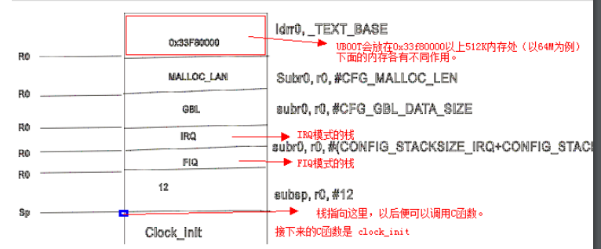
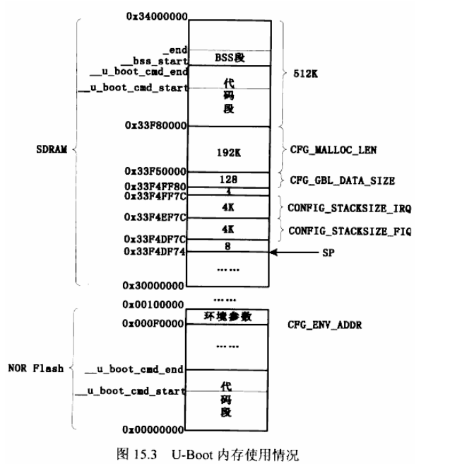

# uboot 第一阶段系统初始化

# 1.硬件相关初始化
## 1.1.初始化：

* 关看门狗
* 初始化时钟
* 初始化 SDRAM
## 1.2.若程序很大，还要将程序从 NAND 拷贝到 SDRAM 中去。
## 1.3.要设置栈(sp),因为要调用 C 函数时，必须用到栈。

* 1.设置栈就是让 SP 寄存器指向某块内存。
* 2.设置好栈后就会调用 C 函数
* 3.函数再读出内核，启动内核。

这是硬件程序。UBOOT 是比较复杂的单片机程序。

# 2.UBOOT运行分析
UBOOT 运行的第一个文件是：`cpu/arm920t/start.S`（从程序的链接脚本中知道

第一条指令跳转到 reset.第一条指令跳转到 reset.

## 2.1 reset
### 2.1.1 管理模式
reset 做的事：管理模式：set the cpu to SVC32 mode 将 CPU 设置为 SVC32 管理模式。

```s
reset:
    // set the cpu to SVC32 mode
    mrc r0, cpsr
    bic r0, r0, #0x1f
    orr r0, r0, #0xd3
    msr cpsr, r0
```

### 2.1.2关闭看门狗

```c
#if defined(CONFIG_S3C2400) || defined(CONFIG_S3C2410)
    ldr r0, =pWTCON
    mov r1, #0x0
    str r1, [r0]
```

### 2.1.3关中断
关中断：屏蔽所有的中断

```s
// mask all IRQs by setting all bits in the INTMR -default
mov r1, #0xffffffff
ldr r0, =INTMSK
str r1, [r0]
#if defined(CONFIG_S3C2410)
ldr r1, =0x3ff
ldr r0, =INTSUBMSK
str r1, [r0]
```

### 2.1.4 CPU 的一些初始化

```s
#ifndef CONFIG_SKIP_LOWLEVEL_INIT
    adr r0, _start      // r0 <-current position of code
    ldr r1, _TEXT_BASE  // test if we run from flash or RMA
    cmp r0, r1          // don't reloc during debug
    blne cpu_init_crit
#endif
```

* adr 是读地址指令，当前`_start`这段代码位于哪里。一开始如上电运行的话，这段代码是从NADN中自动拷贝到 片内4K内存去的。那么这个地址就是`0x00000000`.这个r0就是`0x00000000`.

若程序是**通过仿真器**，调试器之类**直接下载到**SDRAM 中去的放，那这时r0就等于它的链接地址，即`0x33F80000`,即r1 等于 _TEXT_BASE。

`cmp r0,r1`是判断这两个值是否相等。若不等，则**SDRAM 还没有谁去初始化它**。

* 1.`cpu_init_crit`做的事情:

```s
// flush v4 I/D caches
mov r0, #0
mcr p15, 0, r0, c7, c7, 0 /* flash v3/v4 cache*/
mcr p15, 0, r0, c8, c7, 0 /* flush v4 TLB */
```

先关 flush 清 caches。再关 MMU：

```s
// disable MMU stuff and caches
mrc p15, 0, r0, c1, c0, 0
bic r0, r0, #0x00002300     @clear bits 13, 9:8 (--V- --RS)
bic r0, r0, #0x00000087     @clear bits 7, 2:8  (B--- -CAM)
orr r0, r0, #0x00000002     @set bit 2 (A) Align
orr r0, r0, #0x00001000     @set bit 12 (I) I-Cache
mcr p15, 0, r0, c1, c0, 0
```

还有去 lowlevel_init 这个函数:

```s
/* Jump to board special initialization ... The Mask ROM will have already initialized
*  basic memory. Go here to bump up clock rate and handle wake up conditions
*/
mov ip, lr      // persevere link reg across call
bl lowlevel_init // go setup pll, mux memory
mov lr, ip      // restore link
mov pc, lr      // back to my caller
```
这时跳转到 lowlevel_init 去看看执行的是什么。这个文件要找`board\100ask24x0`下的lowlevel_init.S

```S
.globl lowlevel_init
lowlevel_init:
    /* memory control configuration */
    /* make r0 relative the current location so that it */
    /* reads SMRDATA out of FLASH rather than memory ! */
    ldr r0, =SMRDATA
    ldr r1, _TEXT_BASE
    sub r0, r0, r1
    ldr r1, =BWSCON /* Bus Width Status Controller */
    add r2, r0, #13*4
    0:
        ldr r3, [r0], #4
        str r3, [r1], #4
        cmp r2, r0
        bne 0b
        /* everything is fine now */
        mov pc, lr
.ltorg
/* the literal pools origin */
SMRDATA:
    .word
    (0+(B1_BWSCON<<4)+(B2_BWSCON<<8)+(B3_BWSCON<<12)+(B4_BWSCON<<16)+(B5_BWSCON<<20)+(B6_BWSCON<<24)+(B7_BWSCON<<28))
    .word
    ((B0_Tacs<<13)+(B0_Tcos<<11)+(B0_Tacc<<8)+(B0_Tcoh<<6)+(B0_Tah<<4)+(B0_Tacp<<2)+(B0_PMC))
    .word
    ((B1_Tacs<<13)+(B1_Tcos<<11)+(B1_Tacc<<8)+(B1_Tcoh<<6)+(B1_Tah<<4)+(B1_Tacp<<2)+(B1_PMC))
    .word
    ((B2_Tacs<<13)+(B2_Tcos<<11)+(B2_Tacc<<8)+(B2_Tcoh<<6)+(B2_Tah<<4)+(B2_Tacp<<2)+(B2_PMC))
    .word
    ((B3_Tacs<<13)+(B3_Tcos<<11)+(B3_Tacc<<8)+(B3_Tcoh<<6)+(B3_Tah<<4)+(B3_Tacp<<2)+(B3_PMC))
    .word
    ((B4_Tacs<<13)+(B4_Tcos<<11)+(B4_Tacc<<8)+(B4_Tcoh<<6)+(B4_Tah<<4)+(B4_Tacp<<2)+(B4_PMC))
    .word
    ((B5_Tacs<<13)+(B5_Tcos<<11)+(B5_Tacc<<8)+(B5_Tcoh<<6)+(B5_Tah<<4)+(B5_Tacp<<2)+(B5_PMC))
    .word ((B6_MT<<15)+(B6_Trcd<<2)+(B6_SCAN))
    .word ((B7_MT<<15)+(B7_Trcd<<2)+(B7_SCAN))
    .word ((REFEN<<23)+(TREFMD<<22)+(Trp<<20)+(Trc<<18)+(Tchr<<16)+REFCNT)
    .word 0xb1
    .word 0x30
    .word 0x30
```
这段代码是初始化存储控制器。经过这要的初始化后，内存才可以使用

### 2.1.5 设置栈

```S
// set up the stack
stack_up:
    ldr , r0, _TEXT_BASE            /* upper 128kiB: relocate uboot*/
    sub r0, r0, #CFG_MALLOC_LEN     /* malloc area*/
    sub r0, r0, #CFG_GBL_DATA_SIZE  /* bdinfo */

#ifdef CONFIG_USB_IRQ
    sub  r0, r0, #(CONFIG_STACKSIZE_IRQ + CONFIG_STACK_FIQ)
#endif
    sub sp, r0, #12                 /* leave 3 words for abort-stack */

#ifndef CONFIG_SKIP_LOWLEVEL_INIT
    bl clock_init
#endif

#ifndef CONFIG_SKIP_RELOCATE_UBOOT
relocate:                           /* relocate U-Boot to RAM */
    adr r0, _start                  /* r0<-current position of code */
    ldr r1, _TEXT_BASE              /* test if we run from flash or RAM */
    cmd r0, r1                      /* don't relocate during debug */
    beq clear_bss

    ldr r2, _armboot_start
    ldr r3, _bss_start
    sub r2, r3, r2                  /* r2<- source end address */

#if 1
    bl CopyCode2Ram                 /* r0:source, r1:dest, r2:size*/
#else
    /* 汇编实现 */
    add r2, r0, r2                  /* r2<- source end address */
copy_loop:
    ldmia r0, {r3-r10}           /* copy form source address [r0] */
    stmia r1!, {r3-r10}          /* copy to target address [r1] */
    cmp r0, r2                   /* util source end address[r2] */
#endif 
#endif /*CONFIG_SKIP_RELOCATE_UBOOT*/

clear_bss:
    ldr r0, _bss_start           /* find start of bss segment */
    ldr r1, _bss_end             /* stop here */
    mov r2, #0x00000000          /* clear */

clbss_l: str r2, [r0]            /* clear loop ... */
    add r0, r0, #4
    cmp r0, r1
    ble clbss_l

SetLoadFlag:
    /* set a global flag, PreLoadedONRAM */
    adr r0, _start              /* r0 <- current position of code */
    ldr r1, _TEXT_BASE          /* test if we run from flash or RAM*/
    cmp r0, r1                  /* don't reloc during debug */
    ldr r2, = PreLoadedONRAM
    mov r3， #1
    streq r3, [r2]

    ldr pc, _start_armboot

_start_armboot: .word start_armboot
```

设置栈

```s
stack_setup:
ldr r0, _TEXT_BASE //使 r0=_TEXT_BASE(0x33F80000,这是以前定义的，u-boot1.1.6/board/100ask24x0 目录下的 config.mk）
sub r0, r0, #CFG_MALLOC_LEN//使 `r0=上面的 r0(0x33F80000)-CFG_MALLOC_LEN`，则 r0 指向了减过 CFG_MALLOC_LEN 长度的新内存地址处。则这时内存中有一段是 CFG_MALLOC_LEN,

sub r0, r0. #CFG_GBL_DATA_SIZE

//此时的 r0 新指的地址，又是上次的 r0 减去一个
#ifdef CONFIG_USE_IRQ 如果有定义 CONFIG_USE_IRQ
sub r0, r0, #(CONFIG_STACKSIZE_IRQ+CONFIG_STACKSIZE_FIQ)
//则 r0 又指另一个减去 CONFIG_USE_IRQ 和 FIQ 大小之后的新地址。
#endif
sub sp, r0, #12
//这时 r0 指向一个再减去一个 12 之后的地址。这个地址就是栈指针 SP 所指处，如下就 blＣ函数了。
#ifndef CONFIG_SKIP_LOWLEVEL_INIT
bl clock_init
//SP 指向了 r0-12 这个地址，栈设置好了，可以调用 C 函数。
```





uboot 会放在 0x33F80000 处，以下的诸如 IRQ,FIQ 这个栈各有用途。从内存往下排，最后排上 SP 栈指针， 这时便可以调用C 函数了。

### 2.1.6 Clock_init

下面是 Clock_init 函数（初始化时钟）：

```c
void clock_init(void)
{
    S3C24X0_CLOCK_POWER *clk_power = (S3C24X0_CLOCK_POWER *)0x4C000000;
    /* support both of S3C2410 and S3C2440, by */
    if (isS3C2410) {
        /* FCLK:HCLK:PCLK = 1:2:4 */
        clk_power->CLKDIVN = S3C2410_CLKDIV;
        /* change to asynchronous bus mod */
        __asm__( "mrc p15, 0, r1, c1, c0, 0\n" /* read ctrl register */
                "orr r1, r1, #0xc0000000\n" /* Asynchronous */
                "mcr p15, 0, r1, c1, c0, 0\n" /* write ctrl register */
                :::"r1"
                );

        /* to reduce PLL lock time, adjust the LOCKTIME register */
        clk_power->LOCKTIME = 0xFFFFFFFF;
        /* configure UPLL */
        clk_power->UPLLCON = S3C2410_UPLL_48MHZ; //这是USB的时钟。
        /* some delay between MPLL and UPLL */
        delay (4000);
 
        /* configure MPLL */
        clk_power->MPLLCON = S3C2410_MPLL_200MHZ; //整个系统的时钟。
        /* some delay between MPLL and UPLL */
        delay (8000);
    } else {
        /* FCLK:HCLK:PCLK = 1:4:8 */
        clk_power->CLKDIVN = S3C2440_CLKDIV;
        /* change to asynchronous bus mod */
        __asm__( "mrc p15, 0, r1, c1, c0, 0\n" /* read ctrl register */
            "orr r1, r1, #0xc0000000\n" /* Asynchronous */
            "mcr p15, 0, r1, c1, c0, 0\n" /* write ctrl register */
            :::"r1"
            );
        /* to reduce PLL lock time, adjust the LOCKTIME register */
        clk_power->LOCKTIME = 0xFFFFFFFF;
        /* configure UPLL */
        clk_power->UPLLCON = S3C2440_UPLL_48MHZ;
        /* some delay between MPLL and UPLL */
        delay (4000);
        /* configure MPLL */
        clk_power->MPLLCON = S3C2440_MPLL_400MHZ;
        /* some delay between MPLL and UPLL */
        delay (8000);
    }
}
```

### 2.1.7 重定位

```s
relocate:                           /* relocate U-Boot to RAM */
    adr r0, _start                  /* r0<-current position of code */
    ldr r1, _TEXT_BASE              /* test if we run from flash or RAM */
    cmd r0, r1                      /* don't relocate during debug */
    beq clear_bss

    ldr r2, _armboot_start
    ldr r3, _bss_start
    sub r2, r3, r2                  /* r2<- source end address */
```
这是将代码从 flash 中读到 SDRAM 中去，是读到 SDRAM 的链接地址中去。链接地址表示程序运行的时候应该处于链接地址

## 2.1.8 清理bss段

拷贝完程序后，清 bss 段。

```s
lear_bss:
    ldr r0, _bss_start           /* find start of bss segment */
    ldr r1, _bss_end             /* stop here */
    mov r2, #0x00000000          /* clear */

clbss_l: str r2, [r0]            /* clear loop ... */
    add r0, r0, #4
    cmp r0, r1
    ble clbss_l
```

## 2.2 小结
以上过程如下：

* 1.进入 SVC 管理模式。
* 2.关看门狗
* 3.屏蔽中断
* 4.做些初始化（主要是 SDRAM 的初始化）
* 5.设置调用 C 函数的 SP 栈。
* 6.时钟。
* 7.重定位（从 FLASH 拷代码到 SDRAM），函数：CopyCode2Ram
* 8.清 bss 段。bss 段是初始值为 0 的静态的或全局的变量，或是没有初始化的静态或全局变量。它们就放在bss 段里面。它们全部的初始值都被弄成 0。显然这些变量就没必要保存在程序里面了，清bss 段后就是清了它们，这样节省空间。要运行的时候，再去把这些变量相关的位置清 0 就可以再用它们了。

最后调用 C 函数 start_armboot：

其他更复杂的功能就在这里面去实现。

```s
ldr pc, _start_armboot

_start_armboot: .word start_armboot
```
以上便是 2440 硬件的相关初始化，若是换成其他 CPU，初始化的具体内容不一样，但有
相似处。

我们把这些东西叫作 UBOOT 的第一阶段。

# 3.拷贝 代码
从 flash 拷贝代码到 SDRAM 中的函数：

```c
int CopyCode2Ram(unsigned long start_addr, unsigned char *buf, int size)
{
    unsigned int *pdwDest;
    unsinged int *pdwSrc;

    if (bBootFromNorFlash) {
        pdwDest = (unsigned int *)buf;
        pdwSrc = (unsigned int *)start_addr;
        // 从Nor Flash启动
        for (i = 0; i < size/4; i++) {
            pdwDest[i] = pdwSrc[i]; // 从Nor启动，直接从源码拷贝到目的就行
        }
        return 0;
    } else {
        // 初始化NAND Flash
        nand_init_ll();
        nand_read_ll_lp(buf, start_addr, (size + NAND_BLOCK_MASK_LP) & ~(NAND_BLOCK_MASK_LP));
    }
}

static void delay(unsigned long loops)
{
    __asm__ volatile("1:\n"
        "subs %0, %1, $1\n"
        "bne 1b":"=r"(loops):"0"(loops)
    );
}
```

NOR 是和内存接口一样的芯片，它可以像读内存一样去读，函数中可见，如果是从 NOR flash中拷贝代码的
话就很简单。
直接从 源拷贝到目标去。

```c
pdwDest[i] = pdwSrc[i];
```
从 NAND 拷贝的话就要做的事比较多，参看硬件教程部分。。

这个函数就是判断是否NOR启动，若是NOR启动，则 0 地址就对应于 NOR flash。NORflash
不能像内存一样去写。
若从 NAND 启动，则 0 地址就对应于 片内的内存，这时 0 地址是可以写的。

```c
volatile unsigned int *pdw = (volatile unsigned int *)0;
 unsigned int dwVal;
 dwVal = *pdw; 首先读出 0 地址中的内容。
 *pdw = 0x12345678; 然后去修改这个 0 地址。给它写一个值。
 if (*pdw != 0x12345678) 再去读这个值，看是否可正确读出来。
 {
 return 1; 如果将现在的*pdw 0地址读出来不等于写进去的值，
 } 便表明这个 0地址 是不可写的。不可写表明从NOR启动的。
 else
 {
 *pdw = dwVal; 这个 0地址 可写的话，说明是从NAND启动的。
 return 0;
 }
}
```