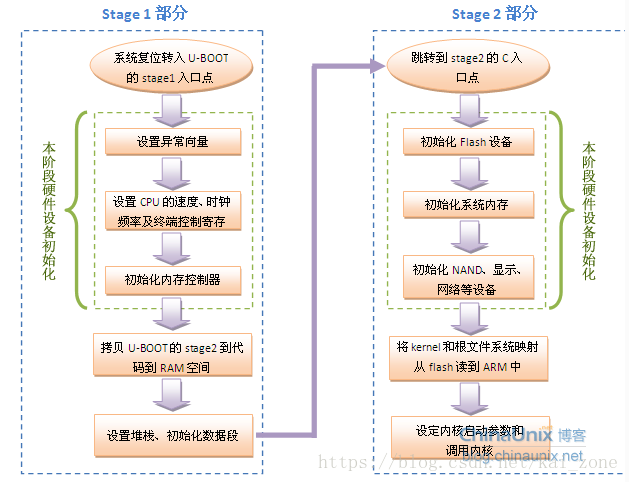

# 1启动流程
u-boot系统启动流程 大多数bootloader都分为stage1和stage2两部分，u-boot也不例外。

依赖于CPU体系结构的代码（如设备初始化代码等）通常都放在stage1且可以**用汇编语言**来实现，而stage2则通常用C语言来实现，这样可以实现复杂的功能，而且有更好的可读性和移植性。

### 1.1 stage1
start.S代码结构 u-boot的stage1代码通常放在start.S文件中，他用汇编语言写成，其主要代码部分如下：

* 1.定义入口,该工作通过修改连接器脚本来完成。
* 2.设置异常向量（Exception Vector）。 
* 3.设置CPU的速度、时钟频率及终端控制寄存器。 
* 4.初始化内存控制器。 
* 5.将ROM中的程序复制到RAM中。 
* 6.关中断，关看门狗
* 7.初始化堆栈，清bss段，为第二阶段准备。
* 8.转到RAM中执行，该工作可使用指令ldr pc来完成。

## 1.2 stage2

C语言代码部分 lib_arm/board.c中的start arm boot是C语言开始的函数也是整个启动代码中C语言的主函数，同时还是整个u-boot（armboot）的主函数，该函数只要完成如下操作： 

* 1.调用一系列的初始化函数。 
* 2.初始化存储设备
* 3.初始化简单硬件如串口，lcd等 
* 4.初始化相关网络设备，填写IP、MAC地址等。 
* 5.进去命令循环（即整个boot的工作循环），接受用户从串口输入的命令，然后进行相应的工作。

### 1.3 u-boot启动顺序
主要顺序如下图：



# 2.代码分析
## 2.1 第一阶段
### 中断向量

```asm
.global_start                //u-boot入口
_start:b  reset              //复位向量并且跳转到reset
ldr pc, _undefined_instruction
ldr pc, _software_interrupt
ldr pc, _prefetch_abort
ldr pc, _data_abort
ldr pc, _not_used
ldr pc, _irq                 //中断向量
ldr pc, _fiq                 //中断向量
b  sleep_setting             //跳转到sleep_setting
```

### 代码拷贝到内存里

```asm
relocate:                  //把uboot重新定位到RAM
adr r0,_start              //r0 是代码的位置
ldr r2, _armboot_start     //r2 是armboot的开始地址ldr r3, _armboot_end       //r3 是armboot的结束地址
sub r2, r3, r2             //r2 得到armboot的大小 

ldr r1, _TEXT_BASE         // r1 得到目标地址  
add r2, r0, r2             // r2 得到源结束地址 
copy_loop:                 //重新定位代码

ldmia r0!, {r3-r10}        //从源地址[r0]中复制
stmia r1!, {r3-r10}        //复制到目标地址[r1]
cmp  r0, r2                //复制数据块直到源数据末尾地址[r2]

ble copy_loop
```

系统上电或reset后，cpu的PC一般都指向0x0地址，在0x0地址上的指令是

```asm
reset:                    //复位启动子程序
/******** 设置CPU为SVC32模式***********/
mrs r0,cpsr               //将CPSR状态寄存器读取，保存到R0中
bic r0,r0,#0x1f
orr r0,r0,#0xd3
msr cpsr,r0               //将R0写入状态寄存器中
/************** 关闭看门狗 ******************/
ldr      r0, =pWTCON
mov     r1, #0x0
str       r1, [r0]
/************** 关闭所有中断 *****************/
mov r1, #0xffffffff
ldr r0, =INTMSK
str r1, [r0]
ldr r2, =0x7ff
ldr r0, =INTSUBMSK
str r2, [r0]
/************** 初始化系统时钟 *****************/
ldr r0, =LOCKTIME
ldr     r1, =0xffffff 
str     r1, [r0]
clear_bss:
        ldr      r0, _bss_start       //找到bss的起始地址 
        add      r0, r0, #4           //从bss的第一个字开始 
        ldr      r1, _bss_end         // bss末尾地址 
        mov      r2, #0x00000000      //清零  
clbss_l:str      r2, [r0]             // bss段空间地址清零循环 
        add      r0, r0, #4
        cmp      r0, r1
        bne      clbss_l
/***************** 关键的初始化子程序 ************************/
/* cpu初始化关键寄存器
*  设置重要寄存器
*  设置内存时钟
*/
cpu_init_crit:
	/** flush v4 I/D caches*/
	mov r0, #0
	mcr p15, 0, r0, c7, c7, 0  /* flush v3/v4 cache */
	mcr p15, 0, r0, c8, c7, 0  /* flush v4 TLB */
/************* disable MMU stuff and caches ****************/
mrc p15, 0, r0, c1, c0, 0
bic r0, r0, #0x00002300 @ clear bits 13, 9:8 (--V- --RS)
bic r0, r0, #0x00000087 @ clear bits 7, 2:0 (B--- -CAM)
orr r0, r0, #0x00000002 @ set bit 2 (A) Align
orr r0, r0, #0x00001000 @ set bit 12 (I) I-Cache
mcr p15, 0, r0, c1, c0, 0
/**在重新定位前，我们要设置RAM的时间，
   因为内存时钟依赖开发板硬件的，
   你将会找到board目录底下的memsetup.S**/
mov ip, lr
#ifndef CONFIG_S3C2440A_JTAG_BOOT
bl memsetup        //调用memsetup子程序（在board/smdk2442memsetup.S）
#endif
mov lr, ip
mov pc, lr         //子程序返回

memsetup:
/**************** 初始化内存 **************/
        mov     r1, #MEM_CTL_BASE
        adrl    r2, mem_cfg_val
        add     r3, r1, #52
1:       ldr     r4, [r2], #4
        str     r4, [r1], #4
        cmp     r1, r3
        bne     1b
/*********** 跳转到原来进来的下一个指令（start.S文件里） ***************/  
mov     pc, lr                 //子程序返回
/****************** 建立堆栈 *******************/
ldr r0, _armboot_end             //armboot_end重定位
add r0, r0, #CONFIG_STACKSIZE    //向下配置堆栈空间
sub sp, r0, #12                  //为abort-stack预留个3字

/**************** 跳转到C代码去 **************/
ldr pc, _start_armboot           //跳转到start_armboot函数入口，
								 //start_armboot字保存函数入口指针

_start_armboot: .word start_armboot    //start_armboot函数在lib_arm/board.c中实现从此进入第二阶段C语言代码部分
```

## 2.2第二阶段C语言部分

```asm
/**************** 异常处理程序 *******************/
.align  5
undefined_instruction:               //未定义指令
get_bad_stack
bad_save_user_regs
bl  do_undefined_instruction
.align 5
software_interrupt:                   //软件中断
get_bad_stack
bad_save_user_regs
bl  do_software_interrupt
.align 5
prefetch_abort:                      //预取异常中止
get_bad_stack
bad_save_user_regs
bl  do_prefetch_abort
.align 5
data_abort:                          //数据异常中止
get_bad_stack
bad_save_user_regs
bl  do_data_abort
.align 5
not_used:                            //未利用
get_bad_stack
bad_save_user_regs
bl  do_not_used
.align 5
irq:                                   //中断请求
get_irq_stack
irq_save_user_regs
bl  do_irq
irq_restore_user_regs
.align 5
fiq:                                   //快速中断请求
get_fiq_stack
/* someone ought to write a more effiction fiq_save_user_regs */
irq_save_user_regs
bl  do_fiq
irq_restore_user_regs
sleep_setting:                           //休眠设置
@ prepare the SDRAM self-refresh mode
ldr r0, =0x48000024 @ REFRESH Register
ldr r1, [r0]
orr r1, r1,#(1bd = &bd_data;
memset (gd->bd, 0, sizeof (bd_t));
monitor_flash_len = _armboot_end_data - _armboot_start;

/*** 调用执行init_sequence数组按顺序执行初始化 ***/
for (init_fnc_ptr = init_sequence; *init_fnc_ptr; ++init_fnc_ptr){
	if ((*init_fnc_ptr)() != 0) {
  		hang();
	}
}

#if 0
/**************** 配置可用的flash单元 *************/
size = flash_init ();             //初始化flash
display_flash_config (size);      //显示flash的大小
/******** _arm_boot在armboot.lds链接脚本中定义 ********/
#endif

#ifdef CONFIG_VFD
	#ifndef PAGE_SIZE
		#define PAGE_SIZE 4096
	#endif
	/*********** 为VFD显示预留内存(整个页面)  **********/
	/******** armboot_real_end在board-specific链接脚本中定义********/
	addr = (_armboot_real_end + (PAGE_SIZE - 1)) & ~(PAGE_SIZE - 1);
	size = vfd_setmem (addr);
	gd->fb_base = addr;
	/******* 进入下一个界面 ********/
	addr += size;
	addr = (addr + (PAGE_SIZE - 1)) & ~(PAGE_SIZE - 1);
	mem_malloc_init (addr);
#else
	/********  armboot_real_end 在board-specific链接脚本中定义 *******/
	mem_malloc_init (_armboot_real_end);
	#endif    /* CONFIG_VFD */
	#if (CONFIG_COMMANDS & CFG_CMD_NAND)
	puts ("NAND:");
	nand_init();  /* NAND初始化 */
	#endif
	#ifdef CONFIG_HAS_DATAFLASH
		AT91F_DataflashInit();
		dataflash_print_info();
	#endif
	/********* 初始化环境 **********/
	env_relocate ();
	/*********** 配置环境变量，重新定位 **********/
	#ifdef CONFIG_VFD
		/* must do this after the framebuffer is allocated */
		drv_vfd_init();
	#endif
	/* 从环境中得到IP地址 */
	bd_data.bi_ip_addr = getenv_IPaddr ("ipaddr");
	/*以太网接口MAC地址*/
	{
	  int i;
	  ulong reg;
	  char *s, *e;
	  uchar tmp[64];
	  i = getenv_r ("ethaddr", tmp, sizeof (tmp));
	  s = (i > 0) ? tmp : NULL;
	  for (reg = 0; reg bd->bi_enetaddr);
#endif
#ifdef CONFIG_DRIVER_LAN91C96
	if (getenv ("ethaddr")) {
	  smc_set_mac_addr(gd->bd->bi_enetaddr);
	}
	/* eth_hw_init(); */
#endif /* CONFIG_DRIVER_LAN91C96 */
/* 通过环境变量初始化*/
if ((s = getenv ("loadaddr")) != NULL) {
  load_addr = simple_strtoul (s, NULL, 16);
} 
#if (CONFIG_COMMANDS & CFG_CMD_NET)
	if ((s = getenv ("bootfile")) != NULL) {
	  copy_filename (BootFile, s, sizeof (BootFile));
	}
#endif /* CFG_CMD_NET */
#ifdef BOARD_POST_INIT
	board_post_init ();
#endif
/* main_loop() 总是试图自动启动，循环不断执行*/
for (;;) {
  main_loop (); /*主循环函数处理执行用户命令—common/main.c
}
/* NOTREACHED - no way out of command loop except booting */
}
```